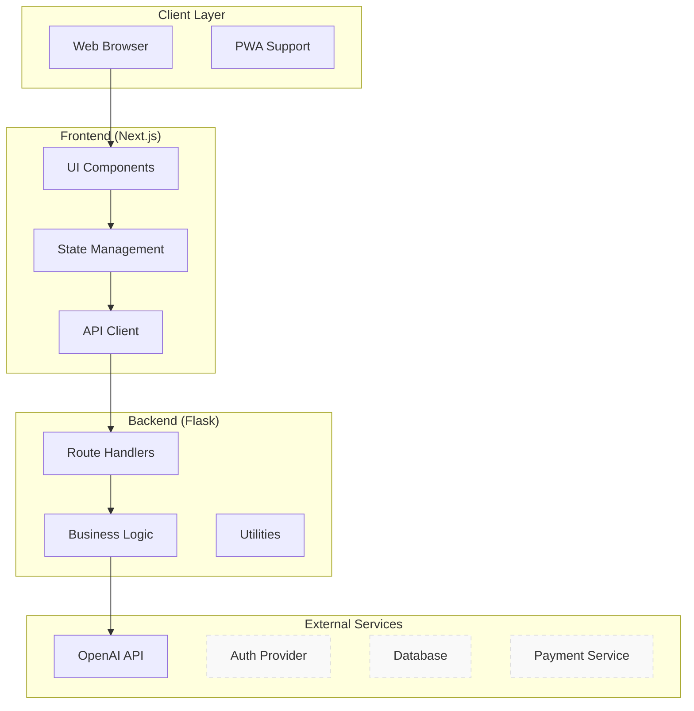
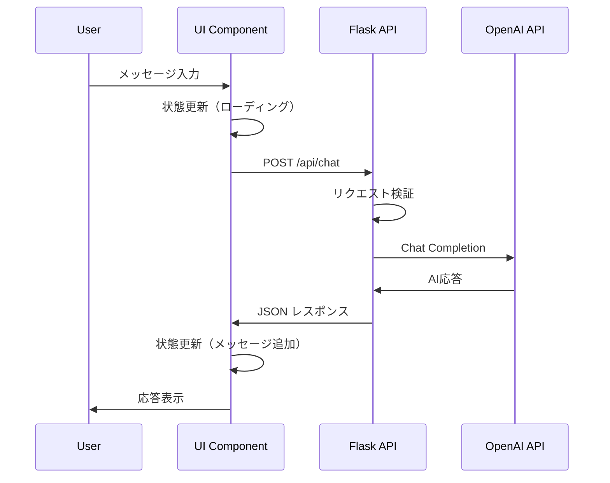
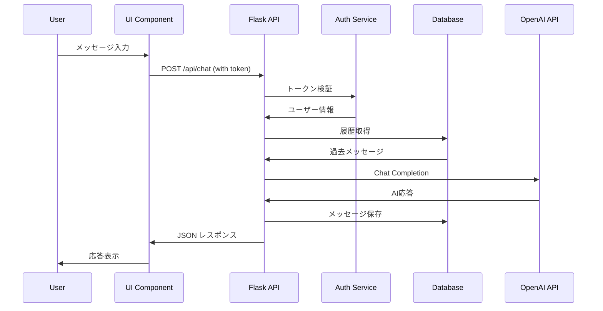

# アーキテクチャ設計書

## 1. システム全体アーキテクチャ

### 1.1 設計思想
本システムは**段階的拡張性**と**疎結合設計**を重視したアーキテクチャを採用します。現在のシンプルな構成から将来の本格的なサービスまで、無理なく成長できる設計を目指します。

### 1.2 アーキテクチャパターン
- **フロントエンド**: Component-Based Architecture (React/Next.js)
- **バックエンド**: Layered Architecture (Flask)
- **将来拡張**: Clean Architecture への段階的移行

### 1.3 システム構成図



## 2. フロントエンドアーキテクチャ

### 2.1 ディレクトリ構造
```
client/src/
├── app/                    # Next.js App Router
│   ├── layout.tsx         # ルートレイアウト
│   ├── page.tsx           # ホームページ
│   ├── globals.css        # グローバルスタイル
│   └── api/               # API Routes (将来)
├── components/            # UIコンポーネント
│   ├── ui/               # 基本UIコンポーネント
│   ├── features/         # 機能別コンポーネント
│   └── layouts/          # レイアウトコンポーネント
├── hooks/                # カスタムフック
├── services/             # API通信サービス
├── types/                # TypeScript型定義
├── utils/                # ユーティリティ関数
└── constants/            # 定数定義
```

### 2.2 コンポーネント分類

#### 2.2.1 UI Components (ui/)
- 再利用可能な基本コンポーネント
- プロップスによる制御
- ビジネスロジックを含まない

```typescript
// 例: Button コンポーネント
interface ButtonProps {
  variant: 'primary' | 'secondary' | 'danger'
  size: 'sm' | 'md' | 'lg'
  disabled?: boolean
  onClick: () => void
  children: React.ReactNode
}
```

#### 2.2.2 Feature Components (features/)
- 特定機能に特化したコンポーネント
- ビジネスロジックを含む
- 状態管理を行う

```typescript
// 例: ChatInterface コンポーネント
interface ChatInterfaceProps {
  initialMessages?: Message[]
  onMessageSend?: (message: string) => void
}
```

#### 2.2.3 Layout Components (layouts/)
- ページレイアウトを定義
- 共通ヘッダー・フッター
- ナビゲーション

### 2.3 状態管理戦略

#### 2.3.1 現在の状態管理
- React Hooks (useState, useEffect)
- コンポーネントローカル状態
- Props による状態の受け渡し

#### 2.3.2 将来の状態管理（拡張時）
- Zustand または Context API
- グローバル状態の最小化
- 状態の正規化

## 3. バックエンドアーキテクチャ

### 3.1 現在の構造
```
backend/
├── app.py              # Flask アプリケーション本体
├── requirements.txt    # 依存関係
└── .env               # 環境変数
```

### 3.2 将来の構造（段階的移行）
```
backend/
├── app.py              # アプリケーションエントリーポイント
├── config/             # 設定管理
│   ├── __init__.py
│   ├── development.py
│   ├── production.py
│   └── testing.py
├── routes/             # ルーティング
│   ├── __init__.py
│   ├── chat.py
│   ├── auth.py         # 将来
│   └── health.py
├── services/           # ビジネスロジック
│   ├── __init__.py
│   ├── chat_service.py
│   ├── openai_service.py
│   └── auth_service.py # 将来
├── models/             # データモデル
│   ├── __init__.py
│   ├── message.py
│   └── user.py         # 将来
├── repositories/       # データアクセス
│   ├── __init__.py
│   └── chat_repository.py # 将来
├── middleware/         # ミドルウェア
│   ├── __init__.py
│   ├── auth.py
│   ├── cors.py
│   └── error_handler.py
├── utils/              # ユーティリティ
│   ├── __init__.py
│   ├── validators.py
│   └── helpers.py
└── tests/              # テスト
    ├── unit/
    ├── integration/
    └── fixtures/
```

### 3.3 レイヤー責任

#### 3.3.1 Routes Layer
- HTTPリクエストの受信
- リクエスト検証
- レスポンス形成
- エラーハンドリング

```python
# 例: chat.py
@chat_bp.route('/api/chat', methods=['POST'])
@require_auth  # ミドルウェア
def chat():
    # リクエスト検証
    # サービス層呼び出し
    # レスポンス返却
```

#### 3.3.2 Services Layer
- ビジネスロジック実装
- 外部API連携
- データ変換・加工
- トランザクション管理

```python
# 例: chat_service.py
class ChatService:
    def process_message(self, message: str, history: List[Message]) -> str:
        # ビジネスロジック実装
        # OpenAI API呼び出し
        # 結果の加工・返却
```

#### 3.3.3 Models Layer
- データ構造定義
- バリデーション
- ドメインロジック

```python
# 例: message.py
@dataclass
class Message:
    id: str
    content: str
    role: MessageRole
    timestamp: datetime
    
    def validate(self) -> bool:
        # バリデーションロジック
```

## 4. データフロー設計

### 4.1 現在のデータフロー


### 4.2 将来のデータフロー（認証・DB追加後）


## 5. 拡張性設計

### 5.1 段階的拡張戦略

#### Phase 1: コード整理（現在）
- 現在のコードをレイヤー構造に整理
- 型定義の整備
- エラーハンドリング統一

#### Phase 2: 認証機能追加
- 認証ミドルウェア追加
- ユーザーモデル導入
- セッション管理

#### Phase 3: データベース統合
- Repository パターン導入
- データ永続化
- マイグレーション機能

#### Phase 4: 高度な機能
- マイクロサービス化検討
- キャッシュ層追加
- 非同期処理導入

### 5.2 依存関係管理

#### 5.2.1 依存性注入の準備
```python
# 将来の依存性注入例
class ChatService:
    def __init__(self, 
                 openai_client: OpenAIClient,
                 chat_repository: ChatRepository,
                 user_service: UserService):
        self.openai_client = openai_client
        self.chat_repository = chat_repository
        self.user_service = user_service
```

#### 5.2.2 インターフェース設計
```python
# 抽象化例
from abc import ABC, abstractmethod

class ChatRepository(ABC):
    @abstractmethod
    def save_message(self, message: Message) -> None:
        pass
    
    @abstractmethod
    def get_history(self, user_id: str, limit: int) -> List[Message]:
        pass
```

## 6. セキュリティアーキテクチャ

### 6.1 現在のセキュリティ層
- 環境変数による機密情報管理
- CORS設定
- Bearer認証（オプション）
- 入力値検証

### 6.2 将来のセキュリティ強化
- JWT認証
- レート制限
- SQL インジェクション対策
- XSS対策
- CSRF対策

## 7. パフォーマンス設計

### 7.1 フロントエンド最適化
- コンポーネントの遅延読み込み
- 画像最適化
- バンドル分割
- キャッシュ戦略

### 7.2 バックエンド最適化
- データベースクエリ最適化
- API レスポンス圧縮
- 非同期処理
- キャッシュ層

## 8. 監視・ログ設計

### 8.1 ログ戦略
- 構造化ログ（JSON形式）
- ログレベル管理
- セキュリティログ
- パフォーマンスログ

### 8.2 監視指標
- レスポンス時間
- エラー率
- API使用量
- リソース使用率

## 9. デプロイメントアーキテクチャ

### 9.1 現在の構成
- Docker マルチステージビルド
- Fly.io シングルインスタンス
- 環境変数管理

### 9.2 将来の構成
- 複数環境対応（dev/staging/prod）
- CI/CD パイプライン
- 自動スケーリング
- 監視・アラート

## 10. 技術的制約・考慮事項

### 10.1 現在の制約
- シングルインスタンス構成
- セッション内履歴のみ
- 基本的なエラーハンドリング

### 10.2 将来の考慮事項
- データベース選択（Supabase）
- 認証プロバイダ選択
- 決済システム統合
- スケーリング戦略

### 10.3 技術的負債管理
- 段階的リファクタリング
- レガシーコード対応
- パフォーマンス改善
- セキュリティ強化