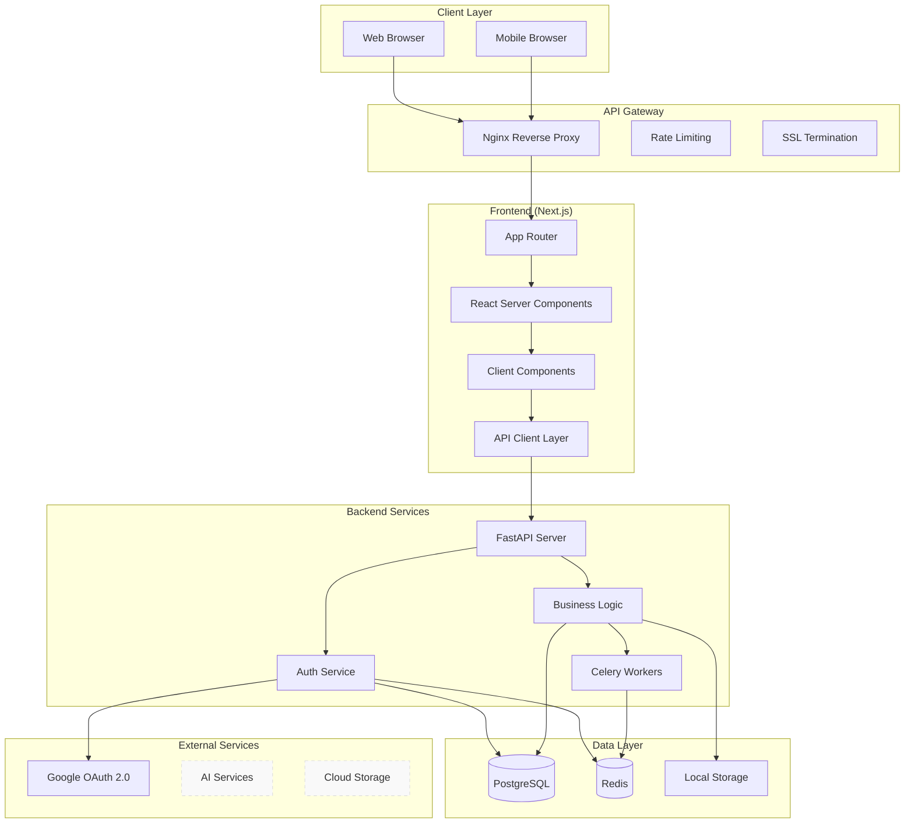

# アーキテクチャ設計書

## 1. システム全体アーキテクチャ

### 1.1 設計思想
本システムは**Feature-based Architecture**と**マイクロサービス指向**を採用し、以下の原則に基づいて設計されています：

- **機能完結型**: 各機能が独立して開発・テスト・デプロイ可能
- **段階的拡張性**: 小規模から大規模まで無理なく成長
- **技術的持続性**: 5年先を見据えた技術選定
- **セルフホスティング優先**: クラウドベンダーロックインの回避

### 1.2 技術スタック概要

#### フロントエンド
- **Framework**: Next.js 14+ (React 18+)
- **Language**: TypeScript
- **Styling**: Tailwind CSS
- **State Management**: Context API / Zustand
- **Build Tool**: Turbopack (Next.js内蔵)

#### バックエンド
- **Framework**: FastAPI (Python 3.11+)
- **ORM**: SQLAlchemy 2.0
- **Validation**: Pydantic v2
- **Task Queue**: Celery + Redis
- **Migration**: Alembic

#### データストア
- **Primary DB**: PostgreSQL 15+ (JSONB活用)
- **Cache/Queue**: Redis 7+
- **File Storage**: Local Filesystem (S3互換移行可能)

#### インフラストラクチャ
- **Container**: Docker + Docker Compose
- **Reverse Proxy**: Nginx
- **Deployment**: セルフホスト → クラウド移行可能

### 1.3 システム構成図


```mermaid
graph TB
    subgraph "Client Layer"
        Browser[Web Browser]
        Mobile[Mobile Browser]
    end
    
    subgraph "Frontend (Next.js)"
        AppRouter[App Router]
        RSC[React Server Components]
        ClientComp[Client Components]
        APIClient[API Client Layer]
    end
    
    subgraph "API Gateway"
        Nginx[Nginx Reverse Proxy]
        RateLimit[Rate Limiting]
        SSL[SSL Termination]
    end
    
    subgraph "Backend Services"
        FastAPI[FastAPI Server]
        AuthService[Auth Service]
        BusinessLogic[Business Logic]
        TaskQueue[Celery Workers]
    end
    
    subgraph "Data Layer"
        PostgreSQL[(PostgreSQL)]
        Redis[(Redis)]
        FileSystem[Local Storage]
    end
    
    subgraph "External Services"
        GoogleOAuth[Google OAuth 2.0]
        Future_AI[AI Services]
        Future_Cloud[Cloud Storage]
    end
    
    Browser --> Nginx
    Mobile --> Nginx
    Nginx --> AppRouter
    AppRouter --> RSC
    RSC --> ClientComp
    ClientComp --> APIClient
    APIClient --> FastAPI
    
    FastAPI --> AuthService
    FastAPI --> BusinessLogic
    BusinessLogic --> TaskQueue
    
    AuthService --> PostgreSQL
    AuthService --> Redis
    TaskQueue --> Redis
    BusinessLogic --> PostgreSQL
    BusinessLogic --> FileSystem
    
    AuthService --> GoogleOAuth
    
    style Future_AI fill:#f9f9f9,stroke:#ddd,stroke-dasharray: 5 5
    style Future_Cloud fill:#f9f9f9,stroke:#ddd,stroke-dasharray: 5 5
```

## 2. アーキテクチャパターン

### 2.1 Feature-based Architecture
```
/src/features/
├── login/          # ログイン機能
├── dashboard/      # ダッシュボード機能
├── automation/     # 自動化機能
└── [feature]/      # 各機能別モジュール
```

**メリット**:
- 機能単位での独立開発
- チーム間の依存性最小化
- 機能削除・追加が容易

### 2.2 レイヤードアーキテクチャ（バックエンド）
```
FastAPI Application
├── Presentation Layer (Routes/Controllers)
├── Application Layer (Services)
├── Domain Layer (Business Logic)
├── Infrastructure Layer (DB/External Services)
```

### 2.3 コンポーネントベースアーキテクチャ（フロントエンド）
```
Next.js Application
├── Pages (App Router)
├── Components (Reusable UI)
├── Hooks (Business Logic)
├── Services (API Communication)
```

## 3. 非機能要件への対応

### 3.1 パフォーマンス
- **SSR/SSG**: Next.jsによる最適化
- **キャッシュ**: Redis多層キャッシュ
- **非同期処理**: FastAPI + Celery
- **DB最適化**: PostgreSQL JSONB インデックス

### 3.2 セキュリティ
- **認証**: JWT (HTTPOnly Cookie)
- **認可**: ロールベースアクセス制御
- **通信**: HTTPS必須
- **CSRF対策**: State parameter + SameSite Cookie

### 3.3 スケーラビリティ
- **水平スケール**: Docker Swarm/K8s対応
- **負荷分散**: Nginx upstream設定
- **データベース**: Read Replica対応
- **キューイング**: Celery分散ワーカー

### 3.4 可用性
- **ヘルスチェック**: /health エンドポイント
- **自動復旧**: Docker restart policy
- **ログ収集**: 集約ログシステム
- **モニタリング**: Prometheus/Grafana対応

## 4. デプロイメントアーキテクチャ

### 4.1 開発環境
```yaml
# Docker Compose による統合開発環境
services:
  frontend: Next.js Dev Server
  backend: FastAPI with hot reload
  postgres: PostgreSQL 15
  redis: Redis 7
```

### 4.2 本番環境（セルフホスト）
```yaml
# Production Docker Compose
services:
  nginx: リバースプロキシ + SSL
  frontend: Next.js Production Build
  backend: FastAPI with Gunicorn
  postgres: PostgreSQL with replication
  redis: Redis with persistence
  celery: Worker processes
```

### 4.3 将来のクラウド移行
- **Option 1**: Fly.io (コンテナネイティブ)
- **Option 2**: Railway (フルマネージド)
- **Option 3**: Oracle Cloud Free Tier
- **Option 4**: AWS/GCP/Azure (エンタープライズ)

## 5. 開発標準

### 5.1 コーディング規約
- **Python**: PEP 8 + Black formatter
- **TypeScript**: ESLint + Prettier
- **SQL**: SQLAlchemy ORM標準
- **API**: OpenAPI 3.0仕様準拠

### 5.2 ディレクトリ構造
```
project-root/
├── frontend/          # Next.js アプリケーション
├── backend/           # FastAPI アプリケーション
├── docker/            # Docker設定ファイル
├── nginx/             # Nginx設定
├── scripts/           # デプロイ・管理スクリプト
└── docs/              # ドキュメント
```

### 5.3 環境管理
- **開発**: .env.development
- **ステージング**: .env.staging
- **本番**: .env.production
- **秘密情報**: 環境変数 or Secrets Manager

## 6. 機能別設計書との関連

### 6.1 参照構造
- **全体設計** (本書): システム全体の方針・共通仕様
- **機能別設計** (/dev_tools/spec/kairo/[機能名]/): 各機能の詳細実装

### 6.2 責任分界
| 項目 | 全体設計書 | 機能別設計書 |
|------|-----------|--------------|
| 技術スタック | ✓ 定義 | 参照のみ |
| API設計標準 | ✓ 定義 | 準拠して実装 |
| データベース設計方針 | ✓ 定義 | 具体的テーブル定義 |
| セキュリティ方針 | ✓ 定義 | 機能別実装 |
| UI/UXガイドライン | ✓ 定義 | 画面別適用 |

### 6.3 機能別設計書一覧
- [ログイン機能](/dev_tools/spec/kairo/login/) - Google OAuth認証
- [ダッシュボード機能](/dev_tools/spec/kairo/dashboard/) - ※未作成
- [自動化機能](/dev_tools/spec/kairo/automation/) - ※未作成

## 7. 技術選定の根拠

### 7.1 Next.js選定理由
- Vercelネイティブ対応
- React Server Components
- 優れた開発体験
- 大規模コミュニティ

### 7.2 FastAPI選定理由
- 高速性能
- 自動API文書生成
- 型安全性（Pydantic）
- 非同期処理標準対応

### 7.3 PostgreSQL選定理由
- JSONB による柔軟性
- ACID準拠の信頼性
- 豊富な拡張機能
- 長期的な安定性

## 8. 移行戦略

### 8.1 段階的成長パス
1. **Phase 1**: 単一サーバー（Docker Compose）
2. **Phase 2**: 複数サーバー（Docker Swarm）
3. **Phase 3**: マネージドサービス活用
4. **Phase 4**: フルクラウドネイティブ

### 8.2 技術的負債の管理
- 定期的なリファクタリング
- 依存関係の定期更新
- パフォーマンス監視
- セキュリティ監査

## 9. 参考資料

### 9.1 関連設計書
- [データベース設計](/dev_tools/spec/02_database_design.md)
- [API設計](/dev_tools/spec/03_api_design.md)
- [画面遷移設計](/dev_tools/spec/04_screen_transition_design.md)

### 9.2 外部リソース
- [Next.js Documentation](https://nextjs.org/docs)
- [FastAPI Documentation](https://fastapi.tiangolo.com)
- [PostgreSQL JSONB Guide](https://www.postgresql.org/docs/current/datatype-json.html)

---

**最終更新日**: 2025-08-29  
**バージョン**: 2.0.0  
**ステータス**: 確定