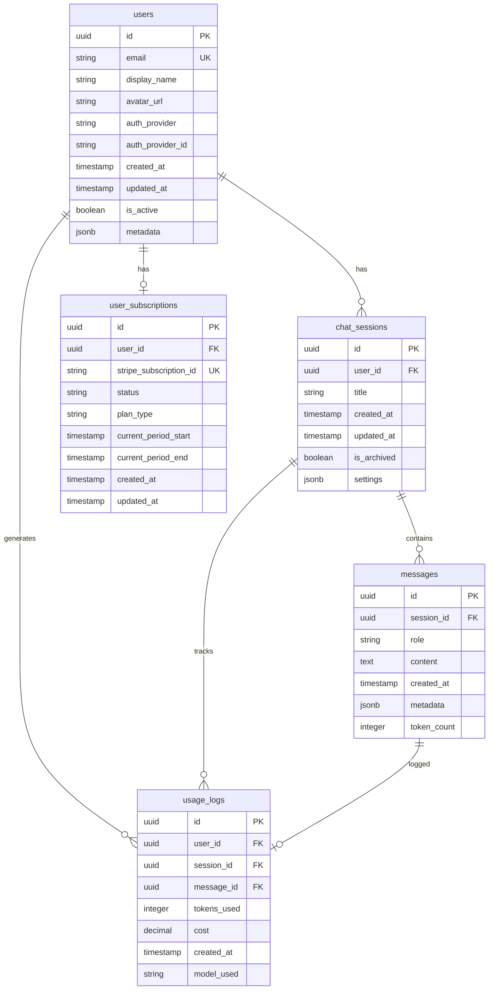

# データベース設計書

## 1. 概要

### 1.1 データベース選択理由
- **Supabase（PostgreSQL）**: 東京リージョン対応、認証機能統合、リアルタイム機能
- **開発効率**: REST API自動生成、TypeScript型定義自動生成
- **拡張性**: PostgreSQLベースで高度なクエリ対応
- **コスト**: 無料枠から段階的スケーリング可能

### 1.2 設計原則
- **正規化**: 第3正規形まで適用
- **パフォーマンス**: 適切なインデックス設計
- **拡張性**: 将来の機能追加を考慮
- **セキュリティ**: Row Level Security (RLS) 活用

## 2. ER図



## 3. テーブル定義

### 3.1 users テーブル
ユーザー基本情報を管理

```sql
CREATE TABLE users (
    id UUID PRIMARY KEY DEFAULT gen_random_uuid(),
    email VARCHAR(255) UNIQUE NOT NULL,
    display_name VARCHAR(100),
    avatar_url TEXT,
    auth_provider VARCHAR(50) NOT NULL, -- 'google', 'apple', 'email'
    auth_provider_id VARCHAR(255) NOT NULL,
    created_at TIMESTAMP WITH TIME ZONE DEFAULT NOW(),
    updated_at TIMESTAMP WITH TIME ZONE DEFAULT NOW(),
    is_active BOOLEAN DEFAULT TRUE,
    metadata JSONB DEFAULT '{}'::jsonb,
    
    CONSTRAINT users_email_check CHECK (email ~* '^[A-Za-z0-9._%+-]+@[A-Za-z0-9.-]+\.[A-Za-z]{2,}$'),
    CONSTRAINT users_auth_provider_check CHECK (auth_provider IN ('google', 'apple', 'email'))
);

-- インデックス
CREATE INDEX idx_users_email ON users(email);
CREATE INDEX idx_users_auth_provider ON users(auth_provider, auth_provider_id);
CREATE INDEX idx_users_created_at ON users(created_at);
```

### 3.2 chat_sessions テーブル
チャットセッション管理

```sql
CREATE TABLE chat_sessions (
    id UUID PRIMARY KEY DEFAULT gen_random_uuid(),
    user_id UUID NOT NULL REFERENCES users(id) ON DELETE CASCADE,
    title VARCHAR(200) DEFAULT 'New Chat',
    created_at TIMESTAMP WITH TIME ZONE DEFAULT NOW(),
    updated_at TIMESTAMP WITH TIME ZONE DEFAULT NOW(),
    is_archived BOOLEAN DEFAULT FALSE,
    settings JSONB DEFAULT '{
        "model": "gpt-4",
        "temperature": 0.7,
        "max_tokens": 1000,
        "system_prompt": "あなたは親切なAIアシスタントです。"
    }'::jsonb
);

-- インデックス
CREATE INDEX idx_chat_sessions_user_id ON chat_sessions(user_id);
CREATE INDEX idx_chat_sessions_created_at ON chat_sessions(created_at);
CREATE INDEX idx_chat_sessions_user_active ON chat_sessions(user_id, is_archived, updated_at);
```

### 3.3 messages テーブル
チャットメッセージ管理

```sql
CREATE TABLE messages (
    id UUID PRIMARY KEY DEFAULT gen_random_uuid(),
    session_id UUID NOT NULL REFERENCES chat_sessions(id) ON DELETE CASCADE,
    role VARCHAR(20) NOT NULL, -- 'user', 'assistant', 'system'
    content TEXT NOT NULL,
    created_at TIMESTAMP WITH TIME ZONE DEFAULT NOW(),
    metadata JSONB DEFAULT '{}'::jsonb,
    token_count INTEGER DEFAULT 0,
    
    CONSTRAINT messages_role_check CHECK (role IN ('user', 'assistant', 'system')),
    CONSTRAINT messages_content_check CHECK (LENGTH(content) > 0)
);

-- インデックス
CREATE INDEX idx_messages_session_id ON messages(session_id);
CREATE INDEX idx_messages_created_at ON messages(created_at);
CREATE INDEX idx_messages_session_created ON messages(session_id, created_at);
```

### 3.4 user_subscriptions テーブル
ユーザーサブスクリプション管理

```sql
CREATE TABLE user_subscriptions (
    id UUID PRIMARY KEY DEFAULT gen_random_uuid(),
    user_id UUID NOT NULL REFERENCES users(id) ON DELETE CASCADE,
    stripe_subscription_id VARCHAR(255) UNIQUE,
    status VARCHAR(50) NOT NULL, -- 'active', 'canceled', 'past_due', 'unpaid'
    plan_type VARCHAR(50) NOT NULL, -- 'free', 'basic', 'premium'
    current_period_start TIMESTAMP WITH TIME ZONE,
    current_period_end TIMESTAMP WITH TIME ZONE,
    created_at TIMESTAMP WITH TIME ZONE DEFAULT NOW(),
    updated_at TIMESTAMP WITH TIME ZONE DEFAULT NOW(),
    
    CONSTRAINT user_subscriptions_status_check CHECK (
        status IN ('active', 'canceled', 'past_due', 'unpaid', 'trialing')
    ),
    CONSTRAINT user_subscriptions_plan_check CHECK (
        plan_type IN ('free', 'basic', 'premium')
    )
);

-- インデックス
CREATE UNIQUE INDEX idx_user_subscriptions_user_id ON user_subscriptions(user_id);
CREATE INDEX idx_user_subscriptions_stripe_id ON user_subscriptions(stripe_subscription_id);
CREATE INDEX idx_user_subscriptions_status ON user_subscriptions(status);
```

### 3.5 usage_logs テーブル
API使用量ログ管理

```sql
CREATE TABLE usage_logs (
    id UUID PRIMARY KEY DEFAULT gen_random_uuid(),
    user_id UUID NOT NULL REFERENCES users(id) ON DELETE CASCADE,
    session_id UUID REFERENCES chat_sessions(id) ON DELETE SET NULL,
    message_id UUID REFERENCES messages(id) ON DELETE SET NULL,
    tokens_used INTEGER NOT NULL DEFAULT 0,
    cost DECIMAL(10, 6) DEFAULT 0.00,
    created_at TIMESTAMP WITH TIME ZONE DEFAULT NOW(),
    model_used VARCHAR(50) DEFAULT 'gpt-4',
    
    CONSTRAINT usage_logs_tokens_check CHECK (tokens_used >= 0),
    CONSTRAINT usage_logs_cost_check CHECK (cost >= 0)
);

-- インデックス
CREATE INDEX idx_usage_logs_user_id ON usage_logs(user_id);
CREATE INDEX idx_usage_logs_created_at ON usage_logs(created_at);
CREATE INDEX idx_usage_logs_user_date ON usage_logs(user_id, created_at);
CREATE INDEX idx_usage_logs_session_id ON usage_logs(session_id);
```

## 4. Row Level Security (RLS) 設定

### 4.1 users テーブル
```sql
ALTER TABLE users ENABLE ROW LEVEL SECURITY;

-- ユーザーは自分の情報のみアクセス可能
CREATE POLICY users_policy ON users
    FOR ALL
    USING (auth.uid() = id);
```

### 4.2 chat_sessions テーブル
```sql
ALTER TABLE chat_sessions ENABLE ROW LEVEL SECURITY;

-- ユーザーは自分のセッションのみアクセス可能
CREATE POLICY chat_sessions_policy ON chat_sessions
    FOR ALL
    USING (user_id = auth.uid());
```

### 4.3 messages テーブル
```sql
ALTER TABLE messages ENABLE ROW LEVEL SECURITY;

-- ユーザーは自分のセッションのメッセージのみアクセス可能
CREATE POLICY messages_policy ON messages
    FOR ALL
    USING (
        session_id IN (
            SELECT id FROM chat_sessions WHERE user_id = auth.uid()
        )
    );
```

### 4.4 user_subscriptions テーブル
```sql
ALTER TABLE user_subscriptions ENABLE ROW LEVEL SECURITY;

-- ユーザーは自分のサブスクリプション情報のみアクセス可能
CREATE POLICY user_subscriptions_policy ON user_subscriptions
    FOR ALL
    USING (user_id = auth.uid());
```

### 4.5 usage_logs テーブル
```sql
ALTER TABLE usage_logs ENABLE ROW LEVEL SECURITY;

-- ユーザーは自分の使用ログのみ参照可能（挿入は管理者のみ）
CREATE POLICY usage_logs_select_policy ON usage_logs
    FOR SELECT
    USING (user_id = auth.uid());

CREATE POLICY usage_logs_insert_policy ON usage_logs
    FOR INSERT
    WITH CHECK (user_id = auth.uid());
```

## 5. ビュー定義

### 5.1 user_stats ビュー
ユーザー統計情報

```sql
CREATE VIEW user_stats AS
SELECT 
    u.id,
    u.email,
    u.display_name,
    COUNT(DISTINCT cs.id) as total_sessions,
    COUNT(DISTINCT m.id) as total_messages,
    COALESCE(SUM(ul.tokens_used), 0) as total_tokens_used,
    COALESCE(SUM(ul.cost), 0) as total_cost,
    u.created_at as user_created_at,
    MAX(cs.updated_at) as last_activity
FROM users u
LEFT JOIN chat_sessions cs ON u.id = cs.user_id
LEFT JOIN messages m ON cs.id = m.session_id
LEFT JOIN usage_logs ul ON u.id = ul.user_id
GROUP BY u.id, u.email, u.display_name, u.created_at;
```

### 5.2 session_summary ビュー
セッション要約情報

```sql
CREATE VIEW session_summary AS
SELECT 
    cs.id,
    cs.user_id,
    cs.title,
    cs.created_at,
    cs.updated_at,
    COUNT(m.id) as message_count,
    COALESCE(SUM(ul.tokens_used), 0) as total_tokens,
    COALESCE(SUM(ul.cost), 0) as total_cost,
    MAX(m.created_at) as last_message_at
FROM chat_sessions cs
LEFT JOIN messages m ON cs.id = m.session_id
LEFT JOIN usage_logs ul ON cs.id = ul.session_id
GROUP BY cs.id, cs.user_id, cs.title, cs.created_at, cs.updated_at;
```

## 6. 関数・トリガー

### 6.1 updated_at 自動更新トリガー
```sql
-- 汎用的な updated_at 更新関数
CREATE OR REPLACE FUNCTION update_updated_at_column()
RETURNS TRIGGER AS $$
BEGIN
    NEW.updated_at = NOW();
    RETURN NEW;
END;
$$ language 'plpgsql';

-- 各テーブルにトリガー設定
CREATE TRIGGER update_users_updated_at 
    BEFORE UPDATE ON users 
    FOR EACH ROW EXECUTE FUNCTION update_updated_at_column();

CREATE TRIGGER update_chat_sessions_updated_at 
    BEFORE UPDATE ON chat_sessions 
    FOR EACH ROW EXECUTE FUNCTION update_updated_at_column();

CREATE TRIGGER update_user_subscriptions_updated_at 
    BEFORE UPDATE ON user_subscriptions 
    FOR EACH ROW EXECUTE FUNCTION update_updated_at_column();
```

### 6.2 セッションタイトル自動生成関数
```sql
CREATE OR REPLACE FUNCTION generate_session_title(session_id UUID)
RETURNS TEXT AS $$
DECLARE
    first_message TEXT;
    title TEXT;
BEGIN
    -- セッションの最初のユーザーメッセージを取得
    SELECT content INTO first_message
    FROM messages 
    WHERE session_id = generate_session_title.session_id 
      AND role = 'user'
    ORDER BY created_at ASC 
    LIMIT 1;
    
    IF first_message IS NULL THEN
        RETURN 'New Chat';
    END IF;
    
    -- 最初の50文字を取得してタイトルとする
    title := LEFT(first_message, 50);
    IF LENGTH(first_message) > 50 THEN
        title := title || '...';
    END IF;
    
    RETURN title;
END;
$$ LANGUAGE plpgsql;
```

## 7. インデックス戦略

### 7.1 パフォーマンス重要クエリ
1. **ユーザーのセッション一覧取得**
   - `chat_sessions(user_id, updated_at DESC)`
   
2. **セッションのメッセージ履歴取得**
   - `messages(session_id, created_at ASC)`
   
3. **ユーザーの使用量集計**
   - `usage_logs(user_id, created_at)`

### 7.2 複合インデックス
```sql
-- セッション一覧取得用
CREATE INDEX idx_chat_sessions_user_updated 
ON chat_sessions(user_id, updated_at DESC) 
WHERE is_archived = FALSE;

-- メッセージ履歴取得用
CREATE INDEX idx_messages_session_created 
ON messages(session_id, created_at ASC);

-- 使用量集計用
CREATE INDEX idx_usage_logs_user_date 
ON usage_logs(user_id, DATE(created_at));

-- 月次集計用
CREATE INDEX idx_usage_logs_monthly 
ON usage_logs(user_id, DATE_TRUNC('month', created_at));
```

## 8. データ保持・アーカイブ戦略

### 8.1 データ保持期間
- **messages**: 無制限（ユーザーが削除するまで）
- **usage_logs**: 2年間（法的要件・分析用）
- **chat_sessions**: 無制限（アーカイブ機能で管理）

### 8.2 アーカイブ処理
```sql
-- 古い使用ログのアーカイブ（2年以上前）
CREATE OR REPLACE FUNCTION archive_old_usage_logs()
RETURNS INTEGER AS $$
DECLARE
    archived_count INTEGER;
BEGIN
    -- 2年以上前のログを別テーブルに移動
    INSERT INTO usage_logs_archive 
    SELECT * FROM usage_logs 
    WHERE created_at < NOW() - INTERVAL '2 years';
    
    GET DIAGNOSTICS archived_count = ROW_COUNT;
    
    DELETE FROM usage_logs 
    WHERE created_at < NOW() - INTERVAL '2 years';
    
    RETURN archived_count;
END;
$$ LANGUAGE plpgsql;
```

## 9. バックアップ・復旧戦略

### 9.1 バックアップ方針
- **自動バックアップ**: Supabase標準機能（日次）
- **手動バックアップ**: 重要な変更前
- **ポイントインタイム復旧**: 7日間

### 9.2 災害復旧
- **RTO**: 4時間以内
- **RPO**: 1時間以内
- **レプリケーション**: 東京リージョン内

## 10. マイグレーション戦略

### 10.1 段階的移行計画
1. **Phase 1**: 基本テーブル作成（users, chat_sessions, messages）
2. **Phase 2**: 認証統合後のユーザーデータ移行
3. **Phase 3**: サブスクリプション・使用量ログ追加
4. **Phase 4**: 高度な機能（検索、分析）追加

### 10.2 マイグレーションファイル管理
```
migrations/
├── 001_initial_schema.sql
├── 002_add_subscriptions.sql
├── 003_add_usage_tracking.sql
├── 004_add_search_indexes.sql
└── rollback/
    ├── 001_rollback.sql
    ├── 002_rollback.sql
    └── ...
```

## 11. パフォーマンス監視

### 11.1 監視対象クエリ
- セッション一覧取得
- メッセージ履歴取得
- 使用量集計
- ユーザー統計

### 11.2 パフォーマンス目標
- **セッション一覧**: < 100ms
- **メッセージ履歴**: < 200ms
- **使用量集計**: < 500ms
- **ユーザー統計**: < 1s

### 11.3 最適化手法
- クエリプラン分析
- インデックス最適化
- パーティショニング（将来）
- キャッシュ戦略