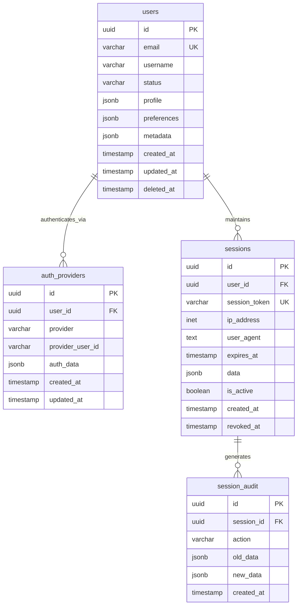
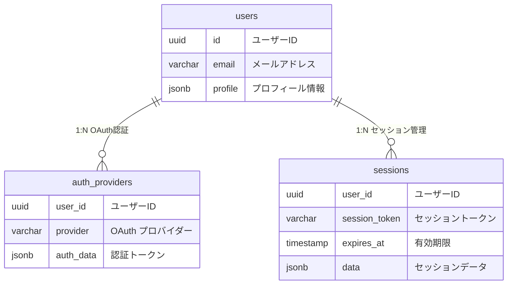

# データベース関係図

**参照元**: [データベース設計書](/dev_tools/spec/02_database_design.md)

## 全体ER図



## 機能別関係図

### 認証系テーブル


## テーブル関係詳細

### 主要リレーション
| 親テーブル | 子テーブル | 関係 | カーディナリティ | 制約 |
|-----------|-----------|------|----------------|------|
| users | auth_providers | 1:N | 1ユーザー:複数プロバイダー | CASCADE DELETE |
| users | sessions | 1:N | 1ユーザー:複数セッション | CASCADE DELETE |
| sessions | session_audit | 1:N | 1セッション:複数監査ログ | なし |

### 外部キー制約詳細
```sql
-- auth_providers → users
ALTER TABLE auth_providers 
ADD CONSTRAINT fk_auth_providers_user_id 
FOREIGN KEY (user_id) REFERENCES users(id) ON DELETE CASCADE;

-- sessions → users  
ALTER TABLE sessions
ADD CONSTRAINT fk_sessions_user_id
FOREIGN KEY (user_id) REFERENCES users(id) ON DELETE CASCADE;

-- session_audit → sessions
ALTER TABLE session_audit
ADD CONSTRAINT fk_session_audit_session_id
FOREIGN KEY (session_id) REFERENCES sessions(id) ON DELETE SET NULL;
```

## ビジネスルール

### 認証プロバイダー
- 1ユーザーは複数の認証プロバイダーを持てる（Google、GitHub等）
- 同一プロバイダーでの重複登録は不可
- プロバイダー削除時は該当認証情報も削除

### セッション管理
- 1ユーザーは最大5つのアクティブセッション
- セッション期限は24時間（設定可能）
- ユーザー削除時は全セッション無効化

### 監査ログ
- セッションの作成・更新・無効化を記録
- セッション削除後も監査ログは保持
- 90日間の保持期間

## クエリパターン

### よく使用されるクエリ
```sql
-- ユーザーのアクティブセッション取得
SELECT s.*, u.email 
FROM sessions s
JOIN users u ON s.user_id = u.id
WHERE u.id = ? 
  AND s.is_active = TRUE 
  AND s.expires_at > CURRENT_TIMESTAMP;

-- プロバイダー別ログイン統計
SELECT 
    ap.provider,
    COUNT(DISTINCT ap.user_id) as unique_users,
    COUNT(s.id) as total_sessions
FROM auth_providers ap
LEFT JOIN sessions s ON ap.user_id = s.user_id
WHERE s.created_at > CURRENT_TIMESTAMP - INTERVAL '30 days'
GROUP BY ap.provider;

-- セキュリティ監視: 複数IPからのアクセス
SELECT u.email, array_agg(DISTINCT s.ip_address) as ip_addresses
FROM users u
JOIN sessions s ON u.id = s.user_id
WHERE s.created_at > CURRENT_TIMESTAMP - INTERVAL '1 day'
GROUP BY u.id, u.email
HAVING COUNT(DISTINCT s.ip_address) > 3;
```

## データ保持・削除ポリシー

### 自動削除ルール
```sql
-- 期限切れセッション（7日後）
DELETE FROM sessions 
WHERE expires_at < CURRENT_TIMESTAMP - INTERVAL '7 days';

-- 無効化セッション（1日後）  
DELETE FROM sessions
WHERE revoked_at < CURRENT_TIMESTAMP - INTERVAL '1 day';

-- 監査ログ（90日後）
DELETE FROM session_audit
WHERE created_at < CURRENT_TIMESTAMP - INTERVAL '90 days';
```

### アーカイブ戦略
```sql
-- 長期保存用アーカイブテーブル
CREATE TABLE sessions_archive (
    LIKE sessions INCLUDING ALL
);

-- 月次アーカイブ移動
INSERT INTO sessions_archive 
SELECT * FROM sessions 
WHERE created_at < CURRENT_TIMESTAMP - INTERVAL '1 month';
```

## パフォーマンス考慮

### 推奨メンテナンス
```sql
-- 月次実行推奨
VACUUM ANALYZE sessions;
VACUUM ANALYZE auth_providers;

-- インデックス使用状況確認
SELECT schemaname, tablename, indexname, idx_tup_read, idx_tup_fetch
FROM pg_stat_user_indexes
WHERE schemaname = 'public';
```

### 容量見積
```sql
-- テーブルサイズ監視
SELECT 
    schemaname,
    tablename,
    pg_size_pretty(pg_total_relation_size(schemaname||'.'||tablename)) as size
FROM pg_tables 
WHERE schemaname = 'public'
ORDER BY pg_total_relation_size(schemaname||'.'||tablename) DESC;
```

## 履歴
- **2025-08-29**: ER図作成・リレーション定義完了
- **2025-08-29**: パフォーマンス最適化設計完了