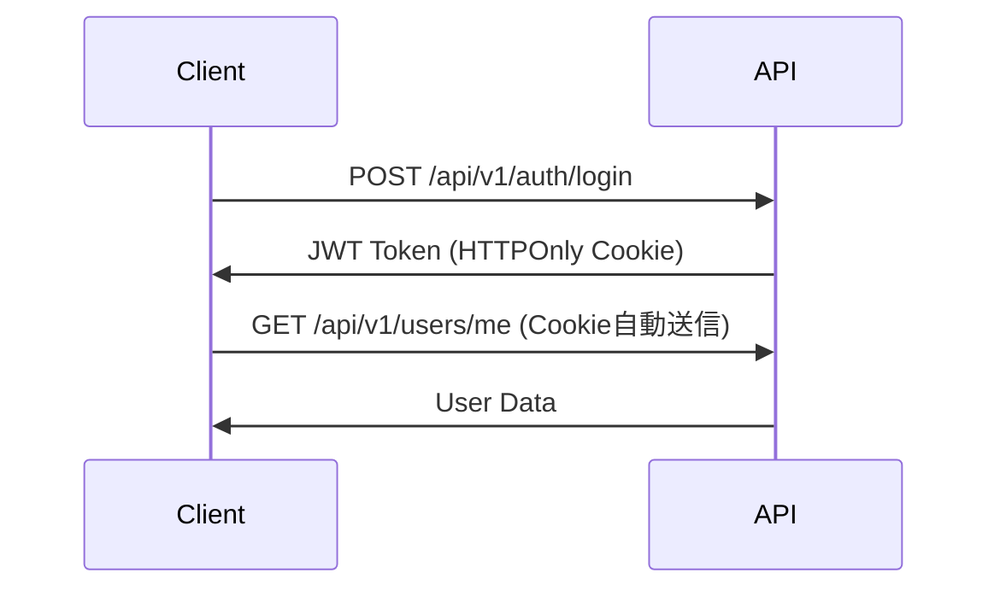

# API設計書

## 1. API設計方針

### 1.1 設計思想
本システムのAPIは**RESTful設計**と**OpenAPI 3.0準拠**を基本とし、以下の原則に従います：

- **一貫性**: 統一されたURL構造とレスポンス形式
- **予測可能性**: 直感的なエンドポイント命名
- **拡張性**: バージョニングによる後方互換性
- **ドキュメント自動生成**: FastAPIによるOpenAPI仕様書自動生成

### 1.2 技術仕様
- **フレームワーク**: FastAPI (Python 3.11+)
- **バリデーション**: Pydantic v2
- **非同期処理**: async/await標準対応
- **ドキュメント**: Swagger UI / ReDoc自動生成

### 1.3 ベースURL
```
開発環境: http://localhost:8000
本番環境: http://home.poco/api (VPN/DNS統一アクセス・nginx プロキシ経由)
将来環境: https://api.example.com (SSL + 独自ドメイン)
```

### 1.4 アクセス方式の特徴
- **開発環境**: 直接FastAPIサーバーアクセス (ポート8000)
- **本番環境**: nginx リバースプロキシ経由 (`home.poco/api/` → `localhost:8000`)
  - **メリット**: フロントエンド・バックエンドの統一ドメイン
  - **対応デバイス**: デスクトップPC + モバイル端末（VPN経由）
  - **相対パス対応**: `/api/auth/login` 形式でAPIアクセス可能

## 2. API標準仕様

### 2.1 URL設計規約
```
/api/v{version}/{resource}/{resource_id}/{sub_resource}

例：
/api/v1/users
/api/v1/users/123
/api/v1/users/123/sessions
```

### 2.2 HTTPメソッド規約
| メソッド | 用途 | 冪等性 |
|---------|------|--------|
| GET | リソース取得 | Yes |
| POST | リソース作成 | No |
| PUT | リソース全体更新 | Yes |
| PATCH | リソース部分更新 | Yes |
| DELETE | リソース削除 | Yes |

### 2.3 レスポンス形式

#### 成功レスポンス
```json
{
    "success": true,
    "data": {
        // リソースデータ
    },
    "meta": {
        "timestamp": "2025-08-29T10:00:00Z",
        "request_id": "req_123456"
    }
}
```

#### エラーレスポンス
```json
{
    "success": false,
    "error": {
        "code": "VALIDATION_ERROR",
        "message": "入力値が不正です",
        "details": [
            {
                "field": "email",
                "message": "有効なメールアドレスを入力してください"
            }
        ]
    },
    "meta": {
        "timestamp": "2025-08-29T10:00:00Z",
        "request_id": "req_123456"
    }
}
```

### 2.4 ステータスコード

| コード | 意味 | 使用場面 |
|--------|------|----------|
| 200 | OK | GET/PUT/PATCH成功 |
| 201 | Created | POST成功（リソース作成） |
| 204 | No Content | DELETE成功 |
| 400 | Bad Request | バリデーションエラー |
| 401 | Unauthorized | 認証エラー |
| 403 | Forbidden | 認可エラー |
| 404 | Not Found | リソース不存在 |
| 409 | Conflict | リソース競合 |
| 422 | Unprocessable Entity | ビジネスロジックエラー |
| 429 | Too Many Requests | レート制限 |
| 500 | Internal Server Error | サーバーエラー |

## 3. 認証・認可

### 3.1 認証方式
```http
Authorization: Bearer {jwt_token}
```

### 3.2 JWT構造
```json
{
    "sub": "user_id",
    "email": "user@example.com",
    "roles": ["user"],
    "exp": 1234567890,
    "iat": 1234567800,
    "jti": "unique_token_id"
}
```

### 3.3 認証フロー


## 4. 共通エンドポイント仕様

### 4.1 ヘルスチェック
```
GET /health

Response:
{
    "status": "healthy",
    "version": "1.0.0",
    "timestamp": "2025-08-29T10:00:00Z"
}
```

### 4.2 OpenAPI仕様書
```
GET /openapi.json  # JSON形式
GET /docs          # Swagger UI
GET /redoc         # ReDoc
```

## 5. データ形式

### 5.1 日時形式
- **形式**: ISO 8601 (UTC)
- **例**: `2025-08-29T10:00:00Z`

### 5.2 ID形式
- **形式**: UUID v4
- **例**: `123e4567-e89b-12d3-a456-426614174000`

### 5.3 ページネーション
```json
{
    "data": [...],
    "pagination": {
        "page": 1,
        "per_page": 20,
        "total_pages": 5,
        "total_items": 100,
        "has_next": true,
        "has_prev": false
    }
}
```

### 5.4 ソート・フィルタリング
```
GET /api/v1/users?sort=-created_at&filter[status]=active&page=1&per_page=20

sort: フィールド名（-で降順）
filter[field]: フィルタ値
page: ページ番号
per_page: 1ページあたりの件数
```

## 6. エラーハンドリング

### 6.1 エラーコード体系
```python
# エラーコード形式: {CATEGORY}_{SPECIFIC_ERROR}

VALIDATION_ERROR     # 入力検証エラー
AUTH_FAILED         # 認証失敗
PERMISSION_DENIED   # 権限不足
NOT_FOUND          # リソース不存在
CONFLICT           # データ競合
RATE_LIMIT         # レート制限
INTERNAL_ERROR     # 内部エラー
```

### 6.2 バリデーションエラー詳細
```python
# Pydantic によるバリデーション
from pydantic import BaseModel, EmailStr, Field

class UserCreate(BaseModel):
    email: EmailStr
    password: str = Field(min_length=8, max_length=100)
    name: str = Field(min_length=1, max_length=100)
```

## 7. セキュリティ

### 7.1 CORS設定
```python
# FastAPI CORS設定
from fastapi.middleware.cors import CORSMiddleware

app.add_middleware(
    CORSMiddleware,
    allow_origins=["https://example.com"],
    allow_credentials=True,
    allow_methods=["*"],
    allow_headers=["*"],
)
```

### 7.2 レート制限
```python
# Redis ベースのレート制限
rate_limit = "100/hour"  # 1時間あたり100リクエスト
```

### 7.3 入力サニタイゼーション
- SQLインジェクション: SQLAlchemy ORM使用
- XSS: HTMLエスケープ処理
- パストラバーサル: パス検証

## 8. 非同期処理

### 8.1 長時間処理
```python
# Celery タスクによる非同期処理
POST /api/v1/tasks/heavy-process

Response:
{
    "task_id": "abc-123",
    "status": "pending",
    "status_url": "/api/v1/tasks/abc-123/status"
}
```

### 8.2 WebSocket（リアルタイム通信）
```python
# WebSocket エンドポイント
ws://localhost:8000/ws/{client_id}

# メッセージ形式
{
    "type": "notification",
    "data": {...}
}
```

## 9. API実装例（FastAPI）

### 9.1 基本的なCRUD実装
```python
from fastapi import FastAPI, HTTPException, Depends
from typing import List
from pydantic import BaseModel

app = FastAPI(title="MyApp API", version="1.0.0")

class UserResponse(BaseModel):
    id: str
    email: str
    name: str

@app.get("/api/v1/users", response_model=List[UserResponse])
async def get_users(
    page: int = 1,
    per_page: int = 20,
    db: Session = Depends(get_db)
):
    """ユーザー一覧取得"""
    users = db.query(User).offset((page-1)*per_page).limit(per_page).all()
    return users

@app.post("/api/v1/users", status_code=201)
async def create_user(
    user: UserCreate,
    db: Session = Depends(get_db)
):
    """ユーザー作成"""
    db_user = User(**user.dict())
    db.add(db_user)
    db.commit()
    return {"id": db_user.id}
```

## 10. テスト仕様

### 10.1 APIテスト
```python
# pytest によるAPIテスト
def test_create_user(client):
    response = client.post(
        "/api/v1/users",
        json={"email": "test@example.com", "password": "password123"}
    )
    assert response.status_code == 201
    assert "id" in response.json()
```

### 10.2 負荷テスト
```bash
# Locust による負荷テスト
locust -f locustfile.py --host=http://localhost:8000
```

## 11. 機能別API仕様への参照

各機能の詳細なAPI仕様は、機能別設計書を参照してください：

- [ログイン機能のAPI](/dev_tools/spec/kairo/login/design.md#api設計)
- [その他機能のAPI](/dev_tools/spec/kairo/[機能名]/design.md)

**注**: 本書では全体的なAPI設計標準と共通仕様を定義しています。各機能固有のエンドポイント定義や詳細な実装は、それぞれの機能別設計書に記載されます。

## 12. API移行戦略

### 12.1 バージョニング戦略
```
/api/v1/... → 現行バージョン
/api/v2/... → 次期バージョン（非互換変更時）
```

### 12.2 廃止予定API
```http
Deprecation: true
Sunset: 2025-12-31
Link: <https://api.example.com/docs/migration>; rel="deprecation"
```

### 12.3 移行期間
- 新バージョンリリース後、最低6ヶ月は旧バージョンサポート
- 廃止3ヶ月前から警告ヘッダー送信

---

**最終更新日**: 2025-08-29  
**バージョン**: 2.0.0  
**ステータス**: 確定