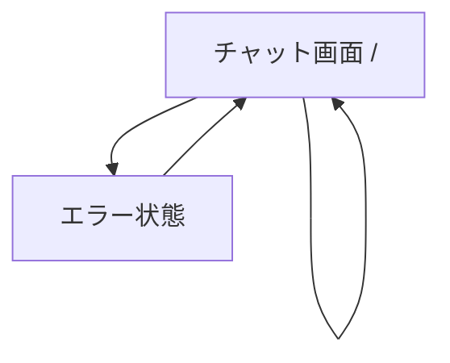
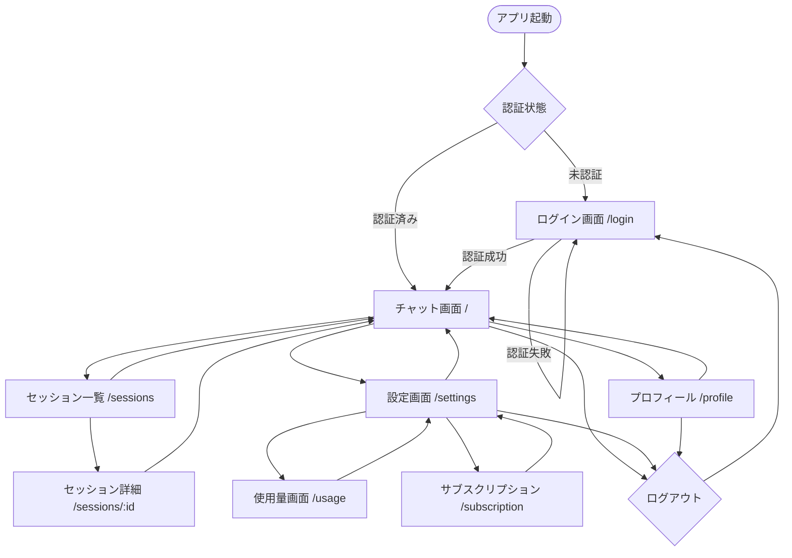

# 画面遷移設計書

## 1. 概要

### 1.1 画面設計原則
- **シンプルさ**: 直感的で分かりやすいUI
- **一貫性**: 統一されたデザインパターン
- **レスポンシブ**: 全デバイス対応
- **アクセシビリティ**: WCAG 2.1 AA準拠
- **パフォーマンス**: 高速な画面遷移

### 1.2 対象デバイス
- **デスクトップ**: 1200px以上
- **タブレット**: 768px - 1199px
- **モバイル**: 320px - 767px

## 2. 画面一覧

### 2.1 現在実装済み画面
- **チャット画面** (`/`): メインのチャットインターフェース

### 2.2 将来実装予定画面
- **ログイン画面** (`/login`): ユーザー認証
- **セッション一覧** (`/sessions`): チャット履歴管理
- **設定画面** (`/settings`): ユーザー設定
- **プロフィール画面** (`/profile`): ユーザー情報管理
- **使用量画面** (`/usage`): API使用量確認
- **サブスクリプション画面** (`/subscription`): 決済管理

## 3. 画面遷移図

### 3.1 現在の画面遷移


### 3.2 将来の画面遷移


## 4. 画面詳細設計

### 4.1 チャット画面 (`/`)

#### 4.1.1 レイアウト構成
```
┌─────────────────────────────────────┐
│ ヘッダー                              │
├─────────────────────────────────────┤
│                                     │
│                                     │
│        メッセージエリア                │
│                                     │
│                                     │
├─────────────────────────────────────┤
│ 入力エリア                            │
└─────────────────────────────────────┘
```

#### 4.1.2 コンポーネント構成
- **ヘッダー**
  - アプリタイトル
  - ユーザーメニュー（将来）
  - 設定ボタン（将来）
  
- **メッセージエリア**
  - メッセージリスト
  - ローディングインジケーター
  - 自動スクロール
  
- **入力エリア**
  - テキスト入力フィールド
  - 送信ボタン
  - 文字数カウンター（将来）

#### 4.1.3 状態管理
```typescript
interface ChatState {
  messages: Message[]
  isLoading: boolean
  error: string | null
  inputValue: string
}
```

#### 4.1.4 レスポンシブ対応
- **デスクトップ**: 最大幅800px、中央配置
- **タブレット**: 画面幅いっぱい、余白調整
- **モバイル**: フルスクリーン、入力エリア固定

### 4.2 ログイン画面 (`/login`) - 将来実装

#### 4.2.1 レイアウト構成
```
┌─────────────────────────────────────┐
│                                     │
│         ロゴ・タイトル                 │
│                                     │
│      ┌─────────────────────┐        │
│      │  Googleでログイン     │        │
│      └─────────────────────┘        │
│                                     │
│      ┌─────────────────────┐        │
│      │  Appleでログイン      │        │
│      └─────────────────────┘        │
│                                     │
│         利用規約・プライバシー          │
│                                     │
└─────────────────────────────────────┘
```

#### 4.2.2 機能要件
- OAuth認証（Google/Apple）
- 利用規約・プライバシーポリシーリンク
- エラーメッセージ表示
- ローディング状態表示

### 4.3 セッション一覧画面 (`/sessions`) - 将来実装

#### 4.2.1 レイアウト構成
```
┌─────────────────────────────────────┐
│ ヘッダー [新規チャット] [設定]         │
├─────────────────────────────────────┤
│ 検索バー                             │
├─────────────────────────────────────┤
│ ┌─────────────────────────────────┐ │
│ │ セッション1                      │ │
│ │ 最後のメッセージプレビュー...      │ │
│ │ 2025/07/22 10:30               │ │
│ └─────────────────────────────────┘ │
│ ┌─────────────────────────────────┐ │
│ │ セッション2                      │ │
│ │ 最後のメッセージプレビュー...      │ │
│ │ 2025/07/21 15:45               │ │
│ └─────────────────────────────────┘ │
└─────────────────────────────────────┘
```

#### 4.3.2 機能要件
- セッション一覧表示
- 検索・フィルタリング
- セッション作成
- セッション削除・アーカイブ
- 無限スクロール

### 4.4 設定画面 (`/settings`) - 将来実装

#### 4.4.1 レイアウト構成
```
┌─────────────────────────────────────┐
│ ヘッダー [戻る]                      │
├─────────────────────────────────────┤
│ 【チャット設定】                      │
│ ○ モデル選択: GPT-4 ▼               │
│ ○ 温度設定: [====|===] 0.7          │
│ ○ 最大トークン: [1000]               │
├─────────────────────────────────────┤
│ 【表示設定】                         │
│ ○ ダークモード: [ON/OFF]             │
│ ○ フォントサイズ: 中 ▼               │
├─────────────────────────────────────┤
│ 【アカウント】                       │
│ ○ プロフィール設定                   │
│ ○ 使用量確認                        │
│ ○ サブスクリプション                 │
│ ○ ログアウト                        │
└─────────────────────────────────────┘
```

#### 4.4.2 機能要件
- チャット設定（モデル、温度、トークン数）
- 表示設定（テーマ、フォント）
- アカウント管理
- データエクスポート

## 5. ナビゲーション設計

### 5.1 現在のナビゲーション
- 単一画面のため、ナビゲーションなし

### 5.2 将来のナビゲーション

#### 5.2.1 メインナビゲーション
- **チャット**: メインのチャット機能
- **履歴**: セッション一覧
- **設定**: アプリ設定

#### 5.2.2 ユーザーメニュー
- **プロフィール**: ユーザー情報
- **使用量**: API使用状況
- **サブスクリプション**: 決済管理
- **ログアウト**: 認証解除

#### 5.2.3 ブレッドクラム
```
ホーム > セッション一覧 > セッション詳細
ホーム > 設定 > 使用量
```

## 6. 権限・アクセス制御

### 6.1 認証状態による制御

#### 6.1.1 未認証ユーザー
- **アクセス可能**: ログイン画面のみ
- **リダイレクト**: 他の画面アクセス時はログイン画面へ

#### 6.1.2 認証済みユーザー
- **アクセス可能**: 全画面
- **リダイレクト**: ログイン画面アクセス時はチャット画面へ

### 6.2 サブスクリプション状態による制御

#### 6.2.1 無料プラン
- **制限**: 月間トークン数制限
- **表示**: 使用量警告、アップグレード促進

#### 6.2.2 有料プラン
- **制限**: プランに応じた制限
- **表示**: 使用量情報、プラン詳細

## 7. エラー画面設計

### 7.1 404エラー画面
```
┌─────────────────────────────────────┐
│                                     │
│            404                      │
│        ページが見つかりません          │
│                                     │
│    お探しのページは存在しないか、      │
│      移動した可能性があります。        │
│                                     │
│      [ホームに戻る] [履歴を見る]       │
│                                     │
└─────────────────────────────────────┘
```

### 7.2 500エラー画面
```
┌─────────────────────────────────────┐
│                                     │
│        サーバーエラー                 │
│                                     │
│    一時的な問題が発生しています。      │
│      しばらく待ってから再度           │
│        お試しください。               │
│                                     │
│         [再読み込み]                 │
│                                     │
└─────────────────────────────────────┘
```

### 7.3 ネットワークエラー画面
```
┌─────────────────────────────────────┐
│                                     │
│       接続エラー                     │
│                                     │
│    インターネット接続を確認して        │
│      再度お試しください。             │
│                                     │
│         [再試行]                    │
│                                     │
└─────────────────────────────────────┘
```

## 8. ローディング・フィードバック

### 8.1 ローディング状態

#### 8.1.1 チャット送信中
- 入力フィールド無効化
- 送信ボタンをスピナーに変更
- メッセージエリアにタイピングインジケーター

#### 8.1.2 画面遷移中
- プログレスバー表示
- 遷移先画面のスケルトン表示

#### 8.1.3 データ読み込み中
- スケルトンスクリーン
- シマーエフェクト

### 8.2 成功・エラーフィードバック

#### 8.2.1 成功メッセージ
- トースト通知
- 緑色のアクセントカラー
- 自動消去（3秒）

#### 8.2.2 エラーメッセージ
- トースト通知またはインライン表示
- 赤色のアクセントカラー
- 手動消去またはタイムアウト

## 9. アニメーション・トランジション

### 9.1 画面遷移アニメーション
- **フェードイン/アウト**: 300ms
- **スライド**: 250ms
- **イージング**: ease-out

### 9.2 要素アニメーション
- **メッセージ追加**: スライドアップ + フェードイン
- **ボタンホバー**: スケール 1.05
- **ローディング**: 回転アニメーション

### 9.3 マイクロインタラクション
- **入力フォーカス**: ボーダー色変更
- **ボタンクリック**: リップルエフェクト
- **メニュー展開**: スライドダウン

## 10. アクセシビリティ

### 10.1 キーボードナビゲーション
- **Tab順序**: 論理的な順序
- **フォーカス表示**: 明確な視覚的フィードバック
- **ショートカット**: Ctrl+Enter（送信）

### 10.2 スクリーンリーダー対応
- **ARIA属性**: 適切なラベル付け
- **セマンティックHTML**: 意味のあるタグ使用
- **代替テキスト**: 画像・アイコンの説明

### 10.3 色・コントラスト
- **コントラスト比**: 4.5:1以上
- **色だけに依存しない**: 形状・テキストでも情報伝達
- **カラーブラインド対応**: 判別しやすい色選択

## 11. パフォーマンス最適化

### 11.1 画面読み込み最適化
- **コード分割**: ページ単位での分割
- **遅延読み込み**: 非表示コンポーネントの遅延
- **プリロード**: 次画面のリソース先読み

### 11.2 画像最適化
- **WebP形式**: 対応ブラウザで使用
- **レスポンシブ画像**: デバイスに応じたサイズ
- **遅延読み込み**: スクロール時に読み込み

### 11.3 キャッシュ戦略
- **静的リソース**: 長期キャッシュ
- **API レスポンス**: 適切なキャッシュ期間
- **Service Worker**: オフライン対応

## 12. 多言語対応（将来実装）

### 12.1 対応言語
- **日本語**: デフォルト
- **英語**: 国際対応
- **中国語**: アジア市場対応

### 12.2 実装方針
- **i18n ライブラリ**: react-i18next
- **翻訳ファイル**: JSON形式
- **動的切り替え**: リロード不要

## 13. PWA対応（将来実装）

### 13.1 機能要件
- **オフライン対応**: 基本機能の利用
- **インストール可能**: ホーム画面追加
- **プッシュ通知**: 重要な通知

### 13.2 実装要素
- **Service Worker**: キャッシュ・オフライン対応
- **Web App Manifest**: アプリ情報定義
- **アイコン**: 各サイズ対応