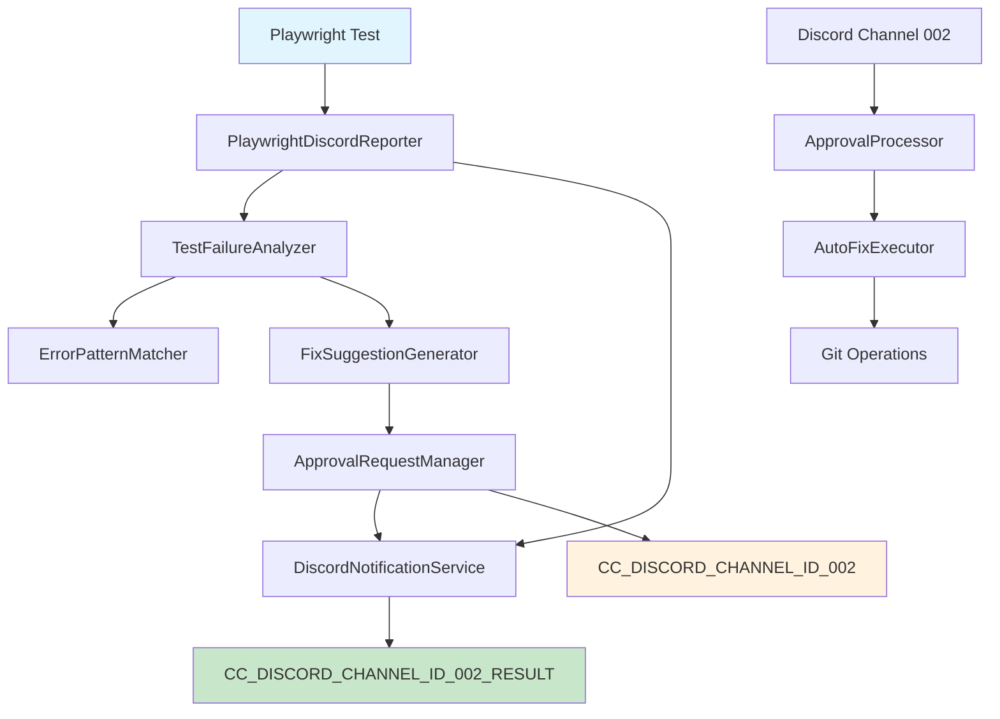

# Discord承認制システム 設計書

## 概要

Playwrightテスト失敗時に自動分析・修正提案・承認フローを提供するシステムの技術設計。既存のPlaywrightDiscordReporterを拡張し、承認制フローを組み込む。

## システム構成図



## アーキテクチャ設計

### 技術スタック

- **Runtime**: Node.js (ES Modules)
- **Framework**: Discord.js v14
- **Testing Framework**: Playwright
- **Version Control**: Git
- **Language**: JavaScript/TypeScript hybrid

### 設計原則

1. **単一責任原則**: 各コンポーネントは明確な責任を持つ
2. **依存性逆転**: インターフェースを通じた疎結合
3. **拡張性**: 新しいエラーパターンや修正方法の追加が容易
4. **冪等性**: 同一操作の重複実行でも安全

## コンポーネント設計

### 1. TestFailureAnalyzer

**責務**: テスト失敗の原因分析

```javascript
class TestFailureAnalyzer {
  constructor(errorPatternMatcher, fixSuggestionGenerator) {
    this.errorPatternMatcher = errorPatternMatcher;
    this.fixSuggestionGenerator = fixSuggestionGenerator;
  }

  async analyzeFailure(testResult) {
    const errorPattern = await this.errorPatternMatcher.match(testResult.error);
    const suggestions = await this.fixSuggestionGenerator.generate(errorPattern, testResult);
    
    return {
      testInfo: testResult,
      errorPattern,
      fixSuggestions: suggestions,
      analysisTimestamp: new Date(),
      confidenceLevel: this.calculateConfidence(errorPattern)
    };
  }
}
```

### 2. ErrorPatternMatcher

**責務**: エラーパターンの識別と分類

```javascript
class ErrorPatternMatcher {
  constructor() {
    this.patterns = [
      {
        name: 'ELEMENT_NOT_FOUND',
        regex: /locator\('.*?'\).*?not found/i,
        category: 'UI_ELEMENT',
        commonCauses: ['Element selector changed', 'Page not loaded', 'Element not visible']
      },
      {
        name: 'TIMEOUT_ERROR',
        regex: /timeout.*?exceeded/i,
        category: 'TIMING',
        commonCauses: ['Slow network', 'Page load delay', 'Animation duration']
      },
      {
        name: 'ASSERTION_FAILURE',
        regex: /expect.*?failed/i,
        category: 'ASSERTION',
        commonCauses: ['Data changed', 'UI behavior changed', 'Race condition']
      }
    ];
  }

  async match(errorMessage) {
    for (const pattern of this.patterns) {
      if (pattern.regex.test(errorMessage)) {
        return {
          ...pattern,
          matchedText: errorMessage.match(pattern.regex)?.[0],
          confidence: this.calculateMatchConfidence(pattern, errorMessage)
        };
      }
    }
    
    return {
      name: 'UNKNOWN_ERROR',
      category: 'UNKNOWN',
      commonCauses: ['Unclassified error'],
      confidence: 0.1
    };
  }
}
```

### 3. FixSuggestionGenerator

**責務**: 修正提案の生成

```javascript
class FixSuggestionGenerator {
  async generate(errorPattern, testResult) {
    const suggestions = [];
    
    switch (errorPattern.category) {
      case 'UI_ELEMENT':
        suggestions.push(...await this.generateUIElementFixes(testResult));
        break;
      case 'TIMING':
        suggestions.push(...await this.generateTimingFixes(testResult));
        break;
      case 'ASSERTION':
        suggestions.push(...await this.generateAssertionFixes(testResult));
        break;
    }
    
    return suggestions.map(s => ({
      ...s,
      priority: this.calculatePriority(s, errorPattern),
      riskLevel: this.assessRisk(s),
      estimatedEffectiveness: this.estimateEffectiveness(s, errorPattern)
    }));
  }

  async generateUIElementFixes(testResult) {
    return [
      {
        type: 'SELECTOR_UPDATE',
        description: 'Update element selector based on current DOM',
        action: 'UPDATE_LOCATOR',
        code: await this.generateSelectorUpdate(testResult),
        automatable: true
      },
      {
        type: 'WAIT_STRATEGY',
        description: 'Add explicit wait for element visibility',
        action: 'ADD_WAIT',
        code: `await page.waitForSelector('${testResult.selector}', { state: 'visible' });`,
        automatable: true
      }
    ];
  }
}
```

### 4. ApprovalRequestManager

**責務**: 承認依頼とスレッド管理

```javascript
class ApprovalRequestManager {
  constructor(discordService, threadManager) {
    this.discordService = discordService;
    this.threadManager = threadManager;
    this.pendingApprovals = new Map();
    this.maxRetryCount = 10;
  }

  async createApprovalRequest(analysis) {
    const requestId = this.generateRequestId();
    const approvalData = {
      id: requestId,
      analysis,
      status: 'PENDING',
      createdAt: new Date(),
      retryCount: 0,
      timeoutAt: new Date(Date.now() + 24 * 60 * 60 * 1000) // 24時間
    };
    
    this.pendingApprovals.set(requestId, approvalData);
    
    // スレッド付き承認依頼送信
    const thread = await this.threadManager.createApprovalThread(approvalData);
    approvalData.threadId = thread.id;
    
    return requestId;
  }

  async processApprovalResponse(requestId, action, feedback = null) {
    const approval = this.pendingApprovals.get(requestId);
    if (!approval) {
      throw new Error(`Approval request ${requestId} not found`);
    }
    
    approval.status = action; // 'APPROVED' | 'REJECTED'
    approval.feedback = feedback;
    approval.resolvedAt = new Date();
    
    return approval;
  }
}
```

### 5. ThreadManager

**責務**: Discordスレッドの作成・管理

```javascript
class ThreadManager {
  constructor(discordService) {
    this.discordService = discordService;
    this.activeThreads = new Map();
  }

  async createApprovalThread(approvalData) {
    const { analysis } = approvalData;
    
    // 承認依頼メッセージを投稿
    const approvalMessage = await this.discordService.sendApprovalRequest(approvalData);
    
    // スレッドを作成
    const thread = await approvalMessage.startThread({
      name: `修正作業: ${analysis.testInfo.testTitle}`,
      autoArchiveDuration: 1440, // 24時間で自動アーカイブ
      reason: `テスト修正承認依頼 (Request ID: ${approvalData.id})`
    });
    
    // スレッド情報を記録
    this.activeThreads.set(approvalData.id, {
      threadId: thread.id,
      messageId: approvalMessage.id,
      createdAt: new Date(),
      status: 'ACTIVE'
    });
    
    // スレッド内に初期メッセージを投稿
    await thread.send(`
🔧 **修正作業スレッド開始**
Request ID: \`${approvalData.id}\`

📋 **作業概要**:
- テスト: ${analysis.testInfo.testTitle}
- ファイル: ${analysis.testInfo.testFile}
- エラーパターン: ${analysis.errorPattern.name}

💬 **このスレッド内で承認・修正作業を進めます**
✅ 承認する場合: "承認" または "OK"
❌ 拒否する場合: "拒否" または "NG"
📝 追加指示がある場合: 自由にコメント
    `);
    
    return thread;
  }

  async getThreadById(requestId) {
    const threadInfo = this.activeThreads.get(requestId);
    if (!threadInfo) {
      throw new Error(`Thread for request ${requestId} not found`);
    }
    
    return await this.discordService.getThread(threadInfo.threadId);
  }

  async sendToThread(requestId, message) {
    const thread = await this.getThreadById(requestId);
    return await thread.send(message);
  }

  async archiveThread(requestId, reason = null) {
    const thread = await this.getThreadById(requestId);
    const threadInfo = this.activeThreads.get(requestId);
    
    // 完了メッセージを送信
    await thread.send(`
🏁 **修正作業完了**
${reason ? `完了理由: ${reason}` : ''}
🕒 作業時間: ${Math.round((Date.now() - new Date(threadInfo.createdAt).getTime()) / 60000)}分

このスレッドは自動的にアーカイブされます。
    `);
    
    // スレッドをアーカイブ
    await thread.setArchived(true, reason || '修正作業完了');
    
    // 記録を更新
    threadInfo.status = 'ARCHIVED';
    threadInfo.archivedAt = new Date();
  }
}
```

### 6. ClaudeCodeIntegrator

**責務**: Claude Codeへの修正依頼と結果処理

```javascript
class ClaudeCodeIntegrator {
  constructor(claudeService, threadManager) {
    this.claudeService = claudeService;
    this.threadManager = threadManager;
    this.executionHistory = [];
  }

  async executeApprovedFix(approvalData) {
    const { analysis } = approvalData;
    const execution = {
      id: this.generateExecutionId(),
      approvalId: approvalData.id,
      startedAt: new Date(),
      status: 'RUNNING'
    };
    
    try {
      // スレッド内に修正開始メッセージを送信
      await this.threadManager.sendToThread(approvalData.id, `
🚀 **修正作業を開始します**
Claude Codeに修正依頼を送信中...
      `);
      
      // Claude Codeに修正依頼メッセージを構築・送信
      const fixRequest = this.buildFixRequestMessage(analysis, approvalData.id);
      await this.claudeService.sendMessageToThread(approvalData.threadId, fixRequest);
      
      execution.status = 'SENT_TO_CLAUDE';
      execution.claudeRequestSent = new Date();
      
      // Claude Codeがスレッド内で実装・テスト・コミットを自動実行
      // 全ての作業進捗はスレッド内で確認可能
      
    } catch (error) {
      execution.status = 'ERROR';
      execution.error = error.message;
      throw error;
    } finally {
      execution.completedAt = new Date();
      this.executionHistory.push(execution);
    }
    
    return execution;
  }

  buildFixRequestMessage(analysis, requestId) {
    return `
🔧 **Playwrightテスト修正依頼** [Request ID: ${requestId}]

📂 **ファイル**: ${analysis.testInfo.testFile}
🐛 **エラー**: ${analysis.errorPattern.name}
\`\`\`
${analysis.testInfo.error.message}
\`\`\`

💡 **修正提案**:
${analysis.fixSuggestions.map(s => 
  `- ${s.description}\n  \`\`\`javascript\n  ${s.code}\n  \`\`\``
).join('\n')}

🎯 **実行手順**:
1. 上記修正をファイルに適用
2. テストを実行して修正効果を確認  
3. 成功時は適切なコミットメッセージでコミット
4. **このスレッド内で作業進捗を報告**
5. 完了時は結果サマリーをCC_DISCORD_CHANNEL_ID_002_RESULTに送信

📝 **注意**: 全ての作業進捗・結果はこのスレッド内で共有してください
    `;
  }
}
```

## データ構造設計

### TypeScript型定義

```typescript
// 基本型定義
export interface TestFailure {
  testId: string;
  testTitle: string;
  testFile: string;
  projectName: string;
  error: {
    message: string;
    stack?: string;
    location?: {
      file: string;
      line: number;
      column: number;
    };
  };
  duration: number;
  attachments: Attachment[];
  timestamp: Date;
}

export interface ErrorPattern {
  name: string;
  category: 'UI_ELEMENT' | 'TIMING' | 'ASSERTION' | 'NETWORK' | 'UNKNOWN';
  regex: RegExp;
  commonCauses: string[];
  confidence: number;
  matchedText?: string;
}

export interface FixSuggestion {
  id: string;
  type: string;
  description: string;
  action: 'UPDATE_LOCATOR' | 'ADD_WAIT' | 'UPDATE_ASSERTION' | 'MODIFY_CONFIG';
  code: string;
  automatable: boolean;
  priority: number;
  riskLevel: 'LOW' | 'MEDIUM' | 'HIGH';
  estimatedEffectiveness: number;
}

export interface AnalysisResult {
  id: string;
  testInfo: TestFailure;
  errorPattern: ErrorPattern;
  fixSuggestions: FixSuggestion[];
  analysisTimestamp: Date;
  confidenceLevel: number;
}

export interface ApprovalRequest {
  id: string;
  analysis: AnalysisResult;
  status: 'PENDING' | 'APPROVED' | 'REJECTED' | 'TIMEOUT';
  createdAt: Date;
  resolvedAt?: Date;
  feedback?: string;
  retryCount: number;
  timeoutAt: Date;
  threadId?: string;
}

export interface ThreadInfo {
  threadId: string;
  messageId: string;
  createdAt: Date;
  status: 'ACTIVE' | 'ARCHIVED';
  archivedAt?: Date;
}

export interface ExecutionResult {
  id: string;
  approvalId: string;
  status: 'RUNNING' | 'SUCCESS' | 'FAILED' | 'ERROR';
  startedAt: Date;
  completedAt?: Date;
  backupBranch?: string;
  error?: string;
  appliedFixes: string[];
}
```

## Discord統合設計

### メッセージフォーマット

#### テスト結果通知 (CC_DISCORD_CHANNEL_ID_002_RESULT)
```markdown
🎭 **Playwright テスト結果** ❌ FAILED

📊 **結果サマリー**
• 総テスト数: 3
• 成功: 2 ✅  
• 失敗: 1 ❌
• 実行時間: 15秒

🕒 実行時刻: 2025/8/24 14:30:15

🔍 **失敗テスト詳細**
📝 テスト: login form validation  
📂 ファイル: auth.spec.js
🌐 ブラウザ: chromium
❌ エラー: Element '#submit-button' not found

[Analysis ID: analysis_12345]
```

#### 承認依頼通知 (CC_DISCORD_CHANNEL_ID_002)
```markdown
🚨 **修正承認依頼** [Request ID: req_12345]

🔗 **関連テスト結果**: analysis_12345 (CC_DISCORD_CHANNEL_ID_002_RESULT参照)

📋 **問題概要**
テスト: login form validation
エラー: Element '#submit-button' not found
信頼度: 85%

🔍 **原因分析**
カテゴリ: UI_ELEMENT
推定原因: Element selector changed

💡 **修正提案**
1. [優先度: HIGH] セレクタ更新
   ```javascript
   // 変更前: '#submit-button'
   // 変更後: '[data-testid="submit-button"]'
   ```
   リスク: LOW | 効果予想: 90%

2. [優先度: MEDIUM] 明示的待機追加
   ```javascript
   await page.waitForSelector('[data-testid="submit-button"]', { state: 'visible' });
   ```
   リスク: LOW | 効果予想: 75%

✅ **承認**: この修正を承認しますか？
❌ **拒否**: この修正を拒否しますか？
📝 **フィードバック**: 追加の指示がありますか？

⏰ **自動タイムアウト**: 24時間後
```

## シーケンス図

```mermaid
sequenceDiagram
    participant PT as Playwright Test
    participant PDR as PlaywrightDiscordReporter  
    participant TFA as TestFailureAnalyzer
    parameter DNS as DiscordNotificationService
    participant ARM as ApprovalRequestManager
    participant TM as ThreadManager
    participant AP as ApprovalProcessor
    participant CCI as ClaudeCodeIntegrator
    participant CC as Claude Code

    PT->>PDR: Test Failed
    PDR->>DNS: Send Result (RESULT Channel)
    PDR->>TFA: Analyze Failure
    TFA->>TFA: Pattern Matching
    TFA->>TFA: Generate Fix Suggestions
    TFA-->>PDR: Analysis Result
    PDR->>ARM: Create Approval Request
    ARM->>TM: Create Thread
    TM->>DNS: Send Approval (MAIN Channel)
    TM->>TM: Start Thread
    TM->>TM: Send Thread Intro Message
    
    Note over ARM: Wait for approval in thread...
    
    ARM->>AP: Process Approval Response
    alt Approved (in thread)
        AP->>CCI: Execute Fix
        CCI->>TM: Send Progress Message
        CCI->>CC: Send Fix Request (in thread)
        CC->>CC: Implement, Test, Commit (in thread)
        CC->>TM: Report Progress (in thread)
        CC->>DNS: Send Final Result (RESULT Channel)
        TM->>TM: Archive Thread
    else Rejected (in thread)
        AP->>TM: Send Rejection Message
        TM->>TM: Archive Thread
    end
```

## エラーハンドリング設計

### エラー分類と処理

1. **システムエラー**
   - Discord API接続エラー → 再試行 (最大3回)
   - Git操作エラー → ロールバック実行
   - テスト実行エラー → 手動確認要求

2. **ビジネスロジックエラー**
   - 不明なエラーパターン → 人間による分析依頼
   - 修正失敗 → バックアップからの復元
   - 承認タイムアウト → 自動キャンセル

3. **リトライ戦略**
   ```javascript
   const retryConfig = {
     discord: { maxRetries: 3, backoffMs: 1000 },
     git: { maxRetries: 2, backoffMs: 500 },
     test: { maxRetries: 1, backoffMs: 0 }
   };
   ```

## セキュリティ設計

### 承認権限管理
- Discord User ID による認証
- 承認可能ユーザーの環境変数管理
- Request ID による改ざん防止

### コード実行制限
- 許可された修正パターンのみ実行
- ファイルシステムアクセス制限
- 外部コマンド実行の禁止

## テスト戦略

### 単体テスト
- **TestFailureAnalyzer**: エラーパターンマッチングテスト
- **FixSuggestionGenerator**: 修正提案生成テスト  
- **ApprovalRequestManager**: 承認管理テスト

### 統合テスト
- **Discord連携**: メッセージ送信・受信テスト
- **Git操作**: コミット・ロールバックテスト
- **E2Eフロー**: 失敗→分析→承認→修正の全フロー

### テストデータ
```javascript
const mockTestFailure = {
  testId: 'test_001',
  testTitle: 'login form validation',
  error: {
    message: "locator('#submit-button') not found",
    stack: 'Error: Element not found...'
  },
  attachments: [{
    type: 'screenshot',
    path: './test-results/screenshot.png'
  }]
};
```

## パフォーマンス設計

### 応答時間目標
- 失敗検知→承認依頼: 30秒以内
- 承認→修正実行: 5秒以内  
- 修正実行→結果通知: 60秒以内

### リソース使用量
- メモリ使用量: 512MB以内
- ディスク使用量: 1GB以内 (ログ・バックアップ含む)

## 実装フェーズ計画

### Phase 1: 基盤構築 (1-2日)
- TestFailureAnalyzer の実装
- ErrorPatternMatcher の基本パターン実装
- FixSuggestionGenerator の基本実装

### Phase 2: Discord統合 (1-1.5日)
- ApprovalRequestManager の実装
- ThreadManager の実装（スレッド作成・管理・アーカイブ）
- Discord メッセージフォーマット整備
- 承認フロー実装

### Phase 3: Claude Code連携実装 (半日)
- ClaudeCodeIntegrator の実装
- スレッド内修正依頼メッセージフォーマット整備
- Claude Codeへのスレッド内依頼送信機能

### Phase 4: テスト・調整 (1-2日)
- 単体テスト実装
- 統合テスト実装
- エラーハンドリング強化