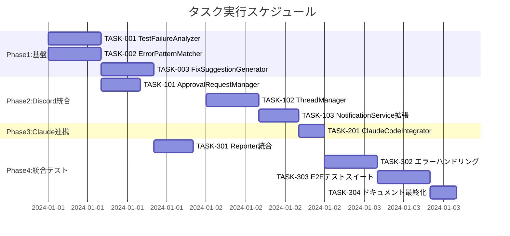

# Discord承認制システム 実装タスク

## 概要

全タスク数: 12
推定作業時間: 3-4日
クリティカルパス: TASK-001 → TASK-101 → TASK-201 → TASK-301

## タスク一覧

### フェーズ1: 基盤構築 (1-2日)

#### TASK-001: TestFailureAnalyzer基盤実装 ✅ **完了**

- [x] **タスク完了** - 2025-08-25実装完了
- **タスクタイプ**: TDD
- **要件リンク**: REQ-002, REQ-105
- **依存タスク**: なし
- **実装詳細**:
  - [x] TestFailureAnalyzer クラス基本構造
  - [x] analyzeFailure メソッド実装
  - [x] 信頼度計算ロジック実装
- **テスト要件**:
  - [x] 単体テスト: 分析ロジック (15テストケース)
  - [x] 統合テスト: ErrorPatternMatcher連携
  - [x] 統合テスト: FixSuggestionGenerator連携
- **完了条件**:
  - [x] テスト失敗情報から分析結果を生成できる
  - [x] 信頼度が正しく計算される
  - [x] エラーハンドリングが適切に動作する
- **TDD完了サマリー**:
  - ✅ Requirements → Testcases → Red → Green → Refactor 全フェーズ完了
  - ✅ 15テストケース 100%成功 (正常5件、異常5件、境界値5件)
  - ✅ 実装ファイル: discord-bot/src/components/ に配置完了
  - ✅ テスト結果: discord-bot/src/test-results/TASK-001-TestFailureAnalyzer-results.json
  - ✅ 実装ドキュメント: discord-bot/docs/implementation/approval-system/TASK-001/
  - ✅ Jest ES Modules設定完了
  - ✅ Discord開発ツール分離ルール適用完了

#### TASK-002: ErrorPatternMatcher実装

- [ ] **タスク完了**
- **タスクタイプ**: TDD  
- **要件リンク**: REQ-002, REQ-105
- **依存タスク**: なし
- **実装詳細**:
  - ErrorPatternMatcher クラス実装
  - 基本エラーパターン定義（UI_ELEMENT, TIMING, ASSERTION）
  - パターンマッチング機能実装
  - 信頼度計算機能実装
- **テスト要件**:
  - [ ] 単体テスト: 各エラーパターンのマッチング
  - [ ] 境界値テスト: 不明エラーの処理
  - [ ] パフォーマンステスト: 大量エラーメッセージ処理
- **エラーパターン**:
  - [ ] ELEMENT_NOT_FOUND: locator要素未発見
  - [ ] TIMEOUT_ERROR: タイムアウト系エラー  
  - [ ] ASSERTION_FAILURE: アサーション失敗
  - [ ] UNKNOWN_ERROR: 未分類エラー
- **完了条件**:
  - [ ] 主要エラーパターンが正しく識別される
  - [ ] 信頼度が適切に計算される
  - [ ] 不明エラーが安全に処理される

#### TASK-003: FixSuggestionGenerator実装

- [ ] **タスク完了**  
- **タスクタイプ**: TDD
- **要件リンク**: REQ-003, REQ-301
- **依存タスク**: TASK-002
- **実装詳細**:
  - FixSuggestionGenerator クラス実装
  - カテゴリ別修正提案生成機能
  - 自動化可能な修正の識別
  - リスク評価・効果予想機能
- **テスト要件**:
  - [ ] 単体テスト: UI_ELEMENT修正提案生成
  - [ ] 単体テスト: TIMING修正提案生成  
  - [ ] 単体テスト: ASSERTION修正提案生成
  - [ ] 統合テスト: ErrorPatternMatcher連携
- **修正提案タイプ**:
  - [ ] SELECTOR_UPDATE: セレクタ更新
  - [ ] WAIT_STRATEGY: 待機戦略追加
  - [ ] ASSERTION_UPDATE: アサーション修正
- **完了条件**:
  - [ ] エラーパターンに応じた修正提案が生成される
  - [ ] 優先度・リスクレベルが正しく評価される
  - [ ] 自動化可能な修正が識別される

### フェーズ2: Discord統合 (1-1.5日)

#### TASK-101: ApprovalRequestManager実装

- [ ] **タスク完了**
- **タスクタイプ**: TDD
- **要件リンク**: REQ-004, REQ-103, REQ-104  
- **依存タスク**: TASK-001
- **実装詳細**:
  - ApprovalRequestManager クラス実装
  - 承認依頼作成・管理機能
  - 承認応答処理機能
  - タイムアウト管理機能（24時間）
- **テスト要件**:
  - [ ] 単体テスト: 承認依頼作成
  - [ ] 単体テスト: 承認応答処理
  - [ ] 統合テスト: ThreadManager連携
  - [ ] タイムアウトテスト: 24時間後の自動処理
- **完了条件**:
  - [ ] 承認依頼が正しく作成・管理される
  - [ ] 承認・拒否が適切に処理される
  - [ ] タイムアウト処理が動作する

#### TASK-102: ThreadManager実装

- [ ] **タスク完了**
- **タスクタイプ**: TDD
- **要件リンク**: REQ-004, NFR-201
- **依存タスク**: なし
- **実装詳細**:
  - ThreadManager クラス実装
  - Discordスレッド作成機能
  - スレッド内メッセージ送信機能
  - スレッド自動アーカイブ機能
- **UI/UX要件**:
  - [ ] スレッド名: "修正作業: {テスト名}"
  - [ ] 自動アーカイブ: 24時間
  - [ ] 初期メッセージ: 作業概要と操作方法
  - [ ] 完了メッセージ: 作業時間と完了理由
- **テスト要件**:
  - [ ] 単体テスト: スレッド作成
  - [ ] 単体テスト: メッセージ送信
  - [ ] 統合テスト: Discord API連携
  - [ ] E2Eテスト: スレッドライフサイクル
- **完了条件**:
  - [ ] スレッドが正しく作成される
  - [ ] スレッド内での作業フローが動作する
  - [ ] 自動アーカイブが機能する

#### TASK-103: DiscordNotificationService拡張

- [ ] **タスク完了**
- **タスクタイプ**: TDD
- **要件リンク**: REQ-001, REQ-004, NFR-201
- **依存タスク**: TASK-102
- **実装詳細**:
  - 既存のDiscordNotificationServiceを拡張
  - 承認依頼メッセージフォーマット実装
  - スレッド連携機能追加
  - チャンネル分離対応（RESULT vs MAIN）
- **メッセージフォーマット要件**:
  - [ ] 承認依頼: 問題概要・原因・修正提案・操作方法
  - [ ] テスト結果: Analysis ID付きで紐づけ情報
  - [ ] 文字数制限: 2000文字以内で分割送信
- **テスト要件**:
  - [ ] 単体テスト: メッセージフォーマット
  - [ ] 統合テスト: Discord API送信
  - [ ] 制限テスト: 2000文字超過時の分割
- **完了条件**:
  - [ ] 承認依頼が適切なフォーマットで送信される
  - [ ] チャンネル分離が正しく動作する
  - [ ] 文字数制限が適切に処理される

### フェーズ3: Claude Code連携実装 (半日)

#### TASK-201: ClaudeCodeIntegrator実装

- [ ] **タスク完了**
- **タスクタイプ**: TDD
- **要件リンク**: REQ-103, REQ-105, REQ-106
- **依存タスク**: TASK-102, TASK-103
- **実装詳細**:
  - ClaudeCodeIntegrator クラス実装
  - スレッド内修正依頼メッセージ構築
  - Claude Service連携機能
  - 進捗通知機能
- **テスト要件**:
  - [ ] 単体テスト: 修正依頼メッセージ構築
  - [ ] 統合テスト: ClaudeService連携
  - [ ] 統合テスト: ThreadManager連携
  - [ ] E2Eテスト: 承認→修正依頼フロー
- **メッセージ要件**:
  - [ ] Request ID付き修正依頼
  - [ ] ファイル・エラー・修正提案の明記
  - [ ] スレッド内作業進捗報告の指示
- **完了条件**:
  - [ ] Claude Codeへの修正依頼が送信される
  - [ ] スレッド内で作業が進行する
  - [ ] 進捗が適切に通知される

### フェーズ4: 統合・テスト (1-2日)

#### TASK-301: PlaywrightDiscordReporter統合

- [ ] **タスク完了**
- **タスクタイプ**: TDD
- **要件リンク**: REQ-001, REQ-101, REQ-102
- **依存タスク**: TASK-001, TASK-101
- **実装詳細**:
  - 既存PlaywrightDiscordReporterの拡張
  - TestFailureAnalyzer統合
  - ApprovalRequestManager統合
  - 失敗時自動承認依頼フロー実装
- **テスト要件**:
  - [ ] 統合テスト: Playwrightテスト失敗→分析→承認依頼
  - [ ] 統合テスト: 成功時は承認依頼なし
  - [ ] E2Eテスト: 全フロー動作確認
- **完了条件**:
  - [ ] テスト失敗時に自動分析が実行される
  - [ ] 承認依頼が適切に送信される
  - [ ] 成功時は従来通りの動作を維持

#### TASK-302: エラーハンドリング強化

- [ ] **タスク完了**
- **タスクタイプ**: TDD
- **要件リンク**: REQ-404, NFR-301, EDGE-001, EDGE-002
- **依存タスク**: TASK-201, TASK-301
- **実装詳細**:
  - Discord API障害時の再試行処理
  - 承認タイムアウト処理
  - 同一エラー10回試行制限
  - 競合状態の安全処理
- **テスト要件**:
  - [ ] 障害テスト: Discord API障害シミュレーション
  - [ ] タイムアウトテスト: 24時間後自動キャンセル
  - [ ] 制限テスト: 10回試行後の動作
  - [ ] 競合テスト: 同時複数失敗処理
- **エラー処理要件**:
  - [ ] Discord API エラー: 3回再試行
  - [ ] 承認タイムアウト: 自動キャンセル処理
  - [ ] 10回失敗: 人間判断への移行
- **完了条件**:
  - [ ] 各種エラーが適切に処理される
  - [ ] システムが安定して動作する
  - [ ] 異常系の回復処理が機能する

#### TASK-303: E2E統合テストスイート

- [ ] **タスク完了**
- **タスクタイプ**: TDD
- **要件リンク**: 全要件
- **依存タスク**: TASK-302
- **実装詳細**:
  - 主要ユーザーフローのE2Eテスト実装
  - モックDiscord環境構築
  - CI/CD統合準備
- **テストシナリオ**:
  - [ ] シナリオ1: テスト失敗→分析→承認→修正→成功
  - [ ] シナリオ2: テスト失敗→分析→拒否→終了
  - [ ] シナリオ3: 複数テスト同時失敗→並行処理
  - [ ] シナリオ4: 承認タイムアウト→自動キャンセル
  - [ ] シナリオ5: 10回修正失敗→人間判断依頼
- **テスト要件**:
  - [ ] パフォーマンステスト: 30秒以内応答
  - [ ] 耐久性テスト: 24時間連続実行
  - [ ] 負荷テスト: 同時10件失敗処理
- **完了条件**:
  - [ ] 全シナリオが正常動作する
  - [ ] パフォーマンス要件を満たす
  - [ ] 耐久性テストをクリアする

#### TASK-304: ドキュメント・設定最終化

- [ ] **タスク完了**
- **タスクタイプ**: DIRECT
- **要件リンク**: NFR-101, REQ-401
- **依存タスク**: TASK-303
- **実装詳細**:
  - 環境変数設定ガイド更新
  - CLAUDE.md 承認制ルール追加
  - 運用手順書作成
  - トラブルシューティングガイド作成
- **ドキュメント要件**:
  - [ ] 環境変数: Discord認証・チャンネル設定
  - [ ] 運用手順: 承認フロー・エラー対応
  - [ ] 設定例: .env.example更新
- **完了条件**:
  - [ ] 設定ガイドが整備される
  - [ ] 運用手順が明文化される
  - [ ] トラブル対応方法が文書化される

## 実行順序

## 並行実行可能タスク

### 同時実行可能グループ
- **グループ1**: TASK-001, TASK-002 (基盤コンポーネント)
- **グループ2**: TASK-101, TASK-102 (Discord機能) 
- **グループ3**: TASK-301, TASK-302 (統合・エラー処理)

### クリティカルパス
**TASK-001** → **TASK-101** → **TASK-201** → **TASK-301** → **TASK-302** → **TASK-303** → **TASK-304**

## マイルストーン

### MS1: 基盤完了 (1-2日後) - 進行中 🟡
- [x] TASK-001 ✅完了, [ ] TASK-002, [ ] TASK-003 
- [x] テスト失敗分析機能が動作 (TASK-001完了)

### MS2: Discord統合完了 (2.5-3.5日後)  
- [ ] TASK-101, TASK-102, TASK-103 完了
- [ ] Discord承認依頼・スレッド管理が動作

### MS3: Claude連携完了 (3-4日後)
- [ ] TASK-201 完了  
- [ ] Claude Codeへの修正依頼が動作

### MS4: システム完成 (4-5日後)
- [ ] 全タスク完了
- [ ] 本番運用準備完了