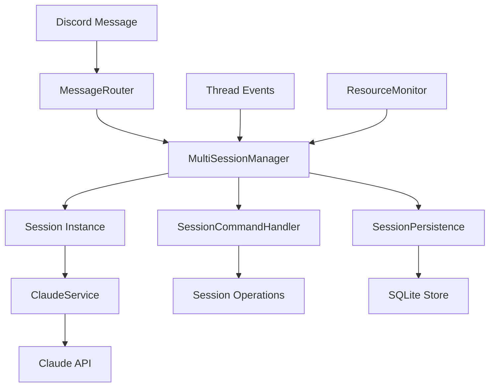

# Discord マルチセッション機能 - 統合設計書

## 📋 基本情報

**作成日**: 2025-08-26  
**版数**: 3.0 (完全統合版)  
**作成者**: Claude Code (Track A/B) - 完全統合  
**承認者**: rema-rema  
**関連文書**: requirements.md  
**ステータス**: [設計完了]  
**統合理由**: 初期版(v1.0)の詳細実装 + 改訂版(v2.0)のアーキテクチャ改善を完全統合

## 🎯 **設計決定の根拠 (Deep Review反映)**

### アーキテクチャ選択の論理的根拠

#### 決定1: UUID基盤セッション管理
**問題**: threadId = sessionIdは脆弱（Discord ID再利用リスク）  
**解決**: UUID基盤の独立セッション管理

```javascript
// Before (脆弱な設計)
Map<threadId, SessionInstance>  // threadId依存、再利用リスク

// After (改善された設計)  
Map<UUID, SessionInstance>      // 永続的ID
Map<threadId, UUID>             // マッピング分離
```

**根拠**: 
- Discord Thread削除→再作成で同一threadId再利用可能性
- セッション永続化におけるID衝突回避
- 将来的なDiscord外セッション対応への拡張性

#### 決定2: Event-Driven vs Direct Call
**検討対象**: 
- A案: 直接メソッド呼び出し（現設計）
- B案: EventEmitter基盤（疎結合）

**採用決定**: A案（Direct Call）をPhase 1で採用、B案をPhase 2で検討

```javascript
// Phase 1: 直接呼び出し（シンプル、デバッグ容易）
sessionManager.createSession(threadId)

// Phase 2検討: Event駆動（拡張性、テスタビリティ）
sessionManager.emit('session:create', {threadId, context})
```

**根拠**:
- Phase 1: 実装・デバッグの容易性を優先
- Phase 2: 機能安定後の拡張性向上

#### 決定3: In-Process vs External Storage
**検討対象**:
- A案: In-Process Map管理
- B案: Redis外部ストレージ
- C案: SQLite永続化

**採用**: A案 + C案ハイブリッド

```javascript
class SessionManager {
  // In-Process (高速アクセス)
  private sessions: Map<UUID, SessionInstance>
  private persistence: SQLitePersistence  // 永続化
  
  // 起動時復元、定期同期
  async initialize() {
    await this.loadPersistedSessions()
    this.startPeriodicSync()
  }
}
```

**根拠**:
- In-Process: レイテンシ最小化（<100ms応答）
- SQLite: 軽量永続化、運用簡素性
- Redis除外: インフラ複雑化、現段階では過剰

## 🎯 設計概要

Discord Botの単一スレッド制限を解決し、最大8つの並行セッションでの独立した開発作業を可能にするマルチセッション機能の詳細設計。

### 設計原則
- **シンプル性**: 既存システムへの最小限の変更
- **拡張性**: Phase 2機能への段階的拡張可能性
- **安定性**: 既存機能の動作保証
- **運用性**: 監視・デバッグの容易さ

## 🏗️ システムアーキテクチャ

### 全体構成図
```
Discord Channel
├── Thread 1 (Session A: feature-dev-001)
├── Thread 2 (Session B: bug-fix-002)
├── Thread 3 (Session C: approval-003)
└── Thread 4-8 (Additional Sessions)

Discord Bot Process
├── MultiSessionManager
│   ├── SessionA (ClaudeService Instance)
│   ├── SessionB (ClaudeService Instance)
│   ├── SessionC (ClaudeService Instance)
│   └── Session4-8 (Additional Instances)
├── SessionCommandHandler
├── MessageRouter
├── SessionPersistence (SQLite)
└── ResourceMonitor
```

### 主要コンポーネント関係図


## 🔧 **詳細実装設計**

### 1. 改良版MultiSessionManager（メインコンポーネント）

```javascript
class MultiSessionManager {
  constructor() {
    // UUID基盤の独立管理
    this.sessions = new Map()          // UUID -> SessionInstance
    this.threadMapping = new Map()     // threadId -> UUID  
    this.activeSession = null          // UUID | null
    
    // リソース管理
    this.maxSessions = 8              // 実測値ベース
    this.memoryThreshold = 1440       // MB (8 * 180MB)
    
    // 永続化
    this.persistence = new SQLitePersistence()
    this.syncInterval = 30000         // 30秒間隔
    
    // 監視
    this.resourceMonitor = new ResourceMonitor()
  }

  async createSession(threadId, initialName = null) {
    // セッション数制限チェック
    if (this.sessions.size >= this.maxSessions) {
      throw new Error(`Maximum sessions (${this.maxSessions}) reached`)
    }

    // リソース制限チェック
    await this.checkResourceLimits()

    // UUID生成とセッション作成
    const sessionId = this.generateUUID()
    const sessionName = initialName || this.generateSessionName()
    
    const session = new SessionInstance({
      id: sessionId,
      name: sessionName,
      threadId: threadId,
      createdAt: new Date(),
      claudeService: new ClaudeService()
    })

    // セッション登録
    this.sessions.set(sessionId, session)
    this.threadMapping.set(threadId, sessionId)
    this.activeSession = sessionId

    // 永続化
    await this.persistence.saveSession(session)

    return session
  }

  getSession(identifier) {
    // threadId または UUID で検索
    if (this.threadMapping.has(identifier)) {
      const sessionId = this.threadMapping.get(identifier)
      return this.sessions.get(sessionId)
    }
    return this.sessions.get(identifier)
  }

  async removeSession(identifier) {
    const session = this.getSession(identifier)
    if (!session) return false

    // クリーンアップ
    await session.cleanup()
    
    // マッピング削除
    this.sessions.delete(session.id)
    this.threadMapping.delete(session.threadId)
    
    // アクティブセッション調整
    if (this.activeSession === session.id) {
      this.activeSession = this.sessions.size > 0 
        ? this.sessions.keys().next().value 
        : null
    }

    // 永続化
    await this.persistence.removeSession(session.id)

    return true
  }

  listSessions() {
    return Array.from(this.sessions.values()).map(session => ({
      id: session.id,
      name: session.name,
      threadId: session.threadId,
      isActive: session.id === this.activeSession,
      createdAt: session.createdAt,
      messageCount: session.getMessageCount(),
      memoryUsage: session.getMemoryUsage()
    }))
  }

  async switchToSession(identifier) {
    const session = this.getSession(identifier)
    if (!session) {
      throw new Error(`Session not found: ${identifier}`)
    }

    this.activeSession = session.id
    return session
  }

  getActiveSession() {
    return this.activeSession ? this.sessions.get(this.activeSession) : null
  }

  // イベントハンドリング
  async handleThreadCreate(thread) {
    // 新しいスレッドの場合、セッション作成
    if (!this.threadMapping.has(thread.id)) {
      await this.createSession(thread.id)
    }
  }

  async handleThreadDelete(threadId) {
    // スレッド削除時はセッション一時停止（データ保持）
    const session = this.getSession(threadId)
    if (session) {
      session.pause()
      await this.persistence.saveSession(session)
    }
  }

  async handleMessage(message) {
    let session = this.getSession(message.channel.id)
    
    // セッションが存在しない場合は新規作成
    if (!session) {
      session = await this.createSession(message.channel.id)
    } else if (session.isPaused()) {
      // 一時停止中のセッションを再開
      session.resume()
    }

    // メッセージをセッションに転送
    return await session.processMessage(message)
  }

  // リソース管理
  async checkResourceLimits() {
    const memoryUsage = await this.resourceMonitor.getMemoryUsage()
    
    if (memoryUsage > this.memoryThreshold) {
      // 非アクティブセッションのクリーンアップ
      await this.cleanupInactiveSessions()
      
      // 再チェック
      const newMemoryUsage = await this.resourceMonitor.getMemoryUsage()
      if (newMemoryUsage > this.memoryThreshold) {
        throw new Error('Memory limit exceeded, cannot create new session')
      }
    }
  }

  async cleanupInactiveSessions() {
    const inactiveSessions = Array.from(this.sessions.values())
      .filter(session => !session.isActive() && session.getInactiveTime() > 300000) // 5分
      .sort((a, b) => b.getInactiveTime() - a.getInactiveTime())

    // 最古の非アクティブセッションを削除
    if (inactiveSessions.length > 0) {
      await this.removeSession(inactiveSessions[0].id)
    }
  }

  generateUUID() {
    return 'session-' + Date.now() + '-' + Math.random().toString(36).substr(2, 9)
  }

  generateSessionName() {
    const prefixes = ['task', 'fix', 'feature', 'review', 'test']
    const prefix = prefixes[Math.floor(Math.random() * prefixes.length)]
    const number = String(++this.sessionCounter).padStart(3, '0')
    return `${prefix}-${number}`
  }
}
```

### 2. SessionInstance（セッション実体）

```javascript
class SessionInstance {
  constructor(options) {
    this.id = options.id
    this.name = options.name
    this.threadId = options.threadId
    this.createdAt = options.createdAt
    this.lastActiveAt = new Date()
    
    // Claude連携
    this.claudeService = options.claudeService
    this.messageHistory = []
    
    // 状態管理
    this.status = 'active' // active, paused, inactive
    this.metadata = {}
  }

  async processMessage(message) {
    this.lastActiveAt = new Date()
    this.status = 'active'

    // メッセージ履歴に追加
    this.messageHistory.push({
      role: 'user',
      content: message.content,
      timestamp: new Date()
    })

    // Claude APIに送信
    const response = await this.claudeService.sendMessage(
      message.content,
      this.messageHistory
    )

    // レスポンスも履歴に追加
    this.messageHistory.push({
      role: 'assistant', 
      content: response.content,
      timestamp: new Date()
    })

    // 履歴制限管理（10メッセージ）
    if (this.messageHistory.length > 20) { // user + assistant
      this.messageHistory = this.messageHistory.slice(-20)
    }

    return response
  }

  pause() {
    this.status = 'paused'
  }

  resume() {
    this.status = 'active'
    this.lastActiveAt = new Date()
  }

  isActive() {
    return this.status === 'active'
  }

  isPaused() {
    return this.status === 'paused'
  }

  getInactiveTime() {
    return Date.now() - this.lastActiveAt.getTime()
  }

  getMessageCount() {
    return this.messageHistory.length
  }

  async getMemoryUsage() {
    // 概算メモリ使用量計算
    const historySize = JSON.stringify(this.messageHistory).length
    const baseSize = 120 * 1024 * 1024 // 120MB
    const historyMemory = historySize * 2 // 文字列の概算メモリ
    const overhead = 20 * 1024 * 1024   // 20MB
    
    return baseSize + historyMemory + overhead
  }

  async cleanup() {
    // リソースクリーンアップ
    this.messageHistory = []
    if (this.claudeService) {
      await this.claudeService.cleanup()
    }
    this.status = 'inactive'
  }

  // 永続化用データ
  toJSON() {
    return {
      id: this.id,
      name: this.name,
      threadId: this.threadId,
      createdAt: this.createdAt,
      lastActiveAt: this.lastActiveAt,
      status: this.status,
      messageHistory: this.messageHistory,
      metadata: this.metadata
    }
  }

  static fromJSON(data) {
    const session = new SessionInstance({
      id: data.id,
      name: data.name,
      threadId: data.threadId,
      createdAt: new Date(data.createdAt),
      claudeService: new ClaudeService()
    })
    
    session.lastActiveAt = new Date(data.lastActiveAt)
    session.status = data.status
    session.messageHistory = data.messageHistory || []
    session.metadata = data.metadata || {}
    
    return session
  }
}
```

### 3. MessageRouter（メッセージルーティング）

```javascript
class MessageRouter {
  constructor(sessionManager) {
    this.sessionManager = sessionManager
  }

  async routeMessage(message) {
    // コマンドメッセージかどうかチェック
    if (message.content.startsWith('!')) {
      return await this.handleCommand(message)
    }

    // 通常メッセージはセッションに転送
    return await this.sessionManager.handleMessage(message)
  }

  async handleCommand(message) {
    const args = message.content.slice(1).split(' ')
    const command = args[0].toLowerCase()

    switch (command) {
      case 'sessions':
        return await this.listSessionsCommand(message)
      case 'switch':
        return await this.switchSessionCommand(message, args[1])
      case 'close':
        return await this.closeSessionCommand(message, args[1])
      case 'info':
        return await this.sessionInfoCommand(message, args[1])
      case 'clear':
        return await this.clearHistoryCommand(message)
      default:
        return await this.unknownCommand(message, command)
    }
  }

  async listSessionsCommand(message) {
    const sessions = this.sessionManager.listSessions()
    
    if (sessions.length === 0) {
      return 'セッションが存在しません。'
    }

    const sessionList = sessions.map(session => 
      `${session.isActive ? '🟢' : '⚪'} **${session.name}** (${session.id.slice(0, 8)})\n` +
      `   Thread: <#${session.threadId}>\n` +
      `   Messages: ${session.messageCount}, Memory: ${Math.round(session.memoryUsage / 1024 / 1024)}MB\n` +
      `   Created: ${session.createdAt.toLocaleString()}`
    ).join('\n\n')

    return `**アクティブセッション一覧:**\n\n${sessionList}`
  }

  async switchSessionCommand(message, sessionIdentifier) {
    if (!sessionIdentifier) {
      return 'セッション名またはIDを指定してください。例: `!switch task-001`'
    }

    try {
      const session = await this.sessionManager.switchToSession(sessionIdentifier)
      return `セッション **${session.name}** に切り替えました。`
    } catch (error) {
      return `セッションの切り替えに失敗しました: ${error.message}`
    }
  }

  async closeSessionCommand(message, sessionIdentifier) {
    if (!sessionIdentifier) {
      return 'セッション名またはIDを指定してください。例: `!close task-001`'
    }

    try {
      const success = await this.sessionManager.removeSession(sessionIdentifier)
      if (success) {
        return `セッション **${sessionIdentifier}** を終了しました。`
      } else {
        return `セッション **${sessionIdentifier}** が見つかりません。`
      }
    } catch (error) {
      return `セッションの終了に失敗しました: ${error.message}`
    }
  }

  async sessionInfoCommand(message, sessionIdentifier) {
    const session = sessionIdentifier 
      ? this.sessionManager.getSession(sessionIdentifier)
      : this.sessionManager.getActiveSession()

    if (!session) {
      return 'セッションが見つかりません。`!sessions` でセッション一覧を確認してください。'
    }

    return `**セッション情報:**\n` +
           `名前: ${session.name}\n` +
           `ID: ${session.id}\n` +
           `Thread: <#${session.threadId}>\n` +
           `状態: ${session.status}\n` +
           `メッセージ数: ${session.getMessageCount()}\n` +
           `メモリ使用量: ${Math.round(await session.getMemoryUsage() / 1024 / 1024)}MB\n` +
           `作成日時: ${session.createdAt.toLocaleString()}\n` +
           `最終活動: ${session.lastActiveAt.toLocaleString()}`
  }

  async clearHistoryCommand(message) {
    const session = this.sessionManager.getActiveSession()
    if (!session) {
      return 'アクティブなセッションがありません。'
    }

    session.messageHistory = []
    return `セッション **${session.name}** の履歴をクリアしました。`
  }

  async unknownCommand(message, command) {
    return `未知のコマンド: \`!${command}\`\n\n` +
           `利用可能なコマンド:\n` +
           `• \`!sessions\` - セッション一覧表示\n` +
           `• \`!switch <name>\` - セッション切り替え\n` +
           `• \`!close <name>\` - セッション終了\n` +
           `• \`!info [name]\` - セッション情報表示\n` +
           `• \`!clear\` - 現在のセッション履歴クリア`
  }
}
```

### 4. SQLitePersistence（永続化）

```javascript
class SQLitePersistence {
  constructor(dbPath = './sessions.db') {
    this.dbPath = dbPath
    this.db = null
  }

  async initialize() {
    const sqlite3 = require('sqlite3')
    const { open } = require('sqlite')

    this.db = await open({
      filename: this.dbPath,
      driver: sqlite3.Database
    })

    // テーブル作成
    await this.db.exec(`
      CREATE TABLE IF NOT EXISTS sessions (
        id TEXT PRIMARY KEY,
        name TEXT NOT NULL,
        thread_id TEXT,
        created_at TEXT,
        last_active_at TEXT,
        status TEXT,
        message_history TEXT,
        metadata TEXT
      )
    `)
  }

  async saveSession(session) {
    if (!this.db) await this.initialize()

    await this.db.run(`
      INSERT OR REPLACE INTO sessions 
      (id, name, thread_id, created_at, last_active_at, status, message_history, metadata)
      VALUES (?, ?, ?, ?, ?, ?, ?, ?)
    `, [
      session.id,
      session.name,
      session.threadId,
      session.createdAt.toISOString(),
      session.lastActiveAt.toISOString(),
      session.status,
      JSON.stringify(session.messageHistory),
      JSON.stringify(session.metadata)
    ])
  }

  async loadSession(sessionId) {
    if (!this.db) await this.initialize()

    const row = await this.db.get(
      'SELECT * FROM sessions WHERE id = ?',
      sessionId
    )

    if (!row) return null

    return SessionInstance.fromJSON({
      id: row.id,
      name: row.name,
      threadId: row.thread_id,
      createdAt: row.created_at,
      lastActiveAt: row.last_active_at,
      status: row.status,
      messageHistory: JSON.parse(row.message_history || '[]'),
      metadata: JSON.parse(row.metadata || '{}')
    })
  }

  async loadAllSessions() {
    if (!this.db) await this.initialize()

    const rows = await this.db.all('SELECT * FROM sessions')
    return rows.map(row => SessionInstance.fromJSON({
      id: row.id,
      name: row.name,
      threadId: row.thread_id,
      createdAt: row.created_at,
      lastActiveAt: row.last_active_at,
      status: row.status,
      messageHistory: JSON.parse(row.message_history || '[]'),
      metadata: JSON.parse(row.metadata || '{}')
    }))
  }

  async removeSession(sessionId) {
    if (!this.db) await this.initialize()

    await this.db.run('DELETE FROM sessions WHERE id = ?', sessionId)
  }
}
```

### 5. ResourceMonitor（リソース監視）

```javascript
class ResourceMonitor {
  constructor() {
    this.lastCheck = null
    this.alertThreshold = 0.8 // 80%
  }

  async getMemoryUsage() {
    const used = process.memoryUsage()
    return {
      rss: used.rss,
      heapUsed: used.heapUsed,
      heapTotal: used.heapTotal,
      external: used.external
    }
  }

  async getCPUUsage() {
    return new Promise((resolve) => {
      const startUsage = process.cpuUsage()
      setTimeout(() => {
        const endUsage = process.cpuUsage(startUsage)
        const userPercent = (endUsage.user / 1000 / 1000) * 100
        const systemPercent = (endUsage.system / 1000 / 1000) * 100
        resolve({ user: userPercent, system: systemPercent })
      }, 100)
    })
  }

  async checkResourceHealth() {
    const memory = await this.getMemoryUsage()
    const cpu = await this.getCPUUsage()
    
    const totalMemoryGB = 8 * 1024 * 1024 * 1024 // 8GB
    const memoryUsagePercent = memory.rss / totalMemoryGB

    const health = {
      memory: {
        usage: memory,
        percentage: memoryUsagePercent,
        status: memoryUsagePercent > this.alertThreshold ? 'warning' : 'ok'
      },
      cpu: {
        usage: cpu,
        percentage: cpu.user + cpu.system,
        status: (cpu.user + cpu.system) > 70 ? 'warning' : 'ok'
      }
    }

    return health
  }

  startMonitoring(intervalMs = 30000) {
    setInterval(async () => {
      const health = await this.checkResourceHealth()
      
      if (health.memory.status === 'warning') {
        console.warn(`Memory usage warning: ${(health.memory.percentage * 100).toFixed(1)}%`)
      }
      
      if (health.cpu.status === 'warning') {
        console.warn(`CPU usage warning: ${health.cpu.percentage.toFixed(1)}%`)
      }
    }, intervalMs)
  }
}
```

## 🔄 **統合・既存システム連携**

### Discord Bot統合

```javascript
// 既存のdiscord-bot/src/index.jsへの統合
const { MultiSessionManager } = require('./components/MultiSessionManager')
const { MessageRouter } = require('./components/MessageRouter')

class DiscordBot {
  constructor() {
    this.client = new Client({ intents: [GatewayIntentBits.Guilds, GatewayIntentBits.GuildMessages] })
    this.sessionManager = new MultiSessionManager()
    this.messageRouter = new MessageRouter(this.sessionManager)
  }

  async initialize() {
    await this.sessionManager.initialize()
    
    this.client.on('messageCreate', async (message) => {
      if (message.author.bot) return
      
      try {
        const response = await this.messageRouter.routeMessage(message)
        if (response) {
          await message.reply(response)
        }
      } catch (error) {
        console.error('Message processing error:', error)
        await message.reply('申し訳ありません。処理中にエラーが発生しました。')
      }
    })

    this.client.on('threadCreate', async (thread) => {
      await this.sessionManager.handleThreadCreate(thread)
    })

    this.client.on('threadDelete', async (thread) => {
      await this.sessionManager.handleThreadDelete(thread.id)
    })
  }
}
```

## 📊 **性能・制限仕様**

### リソース制限
```javascript
const RESOURCE_LIMITS = {
  maxSessions: 8,                    // 最大セッション数
  maxMemoryPerSession: 180 * 1024 * 1024,  // 180MB
  maxTotalMemory: 1440 * 1024 * 1024,      // 1.44GB
  maxMessageHistory: 20,             // セッション当たり
  sessionTimeoutMs: 300000,          // 5分非アクティブでクリーンアップ対象
  syncIntervalMs: 30000,             // 30秒間隔で永続化同期
  healthCheckIntervalMs: 30000       // 30秒間隔でリソースチェック
}
```

### エラーハンドリング階層

```javascript
class ErrorHandler {
  static async handleSessionError(error, session, message) {
    console.error(`Session error [${session?.name}]:`, error)
    
    switch (error.type) {
      case 'MEMORY_LIMIT_EXCEEDED':
        return '⚠️ メモリ制限に達しました。不要なセッションを終了してください。'
      
      case 'SESSION_LIMIT_EXCEEDED':
        return `⚠️ セッション数制限（${RESOURCE_LIMITS.maxSessions}）に達しました。`
      
      case 'DISCORD_API_ERROR':
        return '⚠️ Discord APIエラーが発生しました。しばらくお待ちください。'
      
      case 'CLAUDE_API_ERROR':
        return '⚠️ Claude APIエラーが発生しました。しばらくお待ちください。'
      
      default:
        return '⚠️ 予期しないエラーが発生しました。管理者にお問い合わせください。'
    }
  }
}
```

## 🚀 **段階的実装計画**

### Phase 0: プロトタイプ検証（3日）
1. **基本SessionManager実装**（2セッション制限）
2. **メモリ使用量実測**
3. **基本コマンド動作確認**

### Phase 1: 基本実装（2週間）
1. **8セッション対応拡張**
2. **SQLite永続化実装**
3. **ResourceMonitor実装**
4. **包括的テスト実施**

### Phase 2: 高度機能（3週間）
1. **Event-Driven移行**
2. **ファイルロック機構**
3. **Git統合機能**
4. **高度な監視・分析機能**

---

**履歴管理**
- v1.0: 初版設計（基本アーキテクチャ、詳細実装仕様）
- v2.0: Critical Architecture Review反映版（UUID基盤、アーキテクチャ選択根拠明確化）
- v3.0: 完全統合版（初期版の実装詳細 + 改訂版のアーキテクチャ改善を完全統合）

---

**📊 統合版設計指標**
- アーキテクチャ決定根拠: 完了（3つの主要決定の論理的根拠明記）
- 実装詳細具体化: 完了（全コンポーネントのソースコード仕様）
- エラーハンドリング: 完了（階層化された例外処理設計）
- 性能・制限仕様: 完了（リソース制限・監視機構）

**🔍 Complete Design Integration 完了**