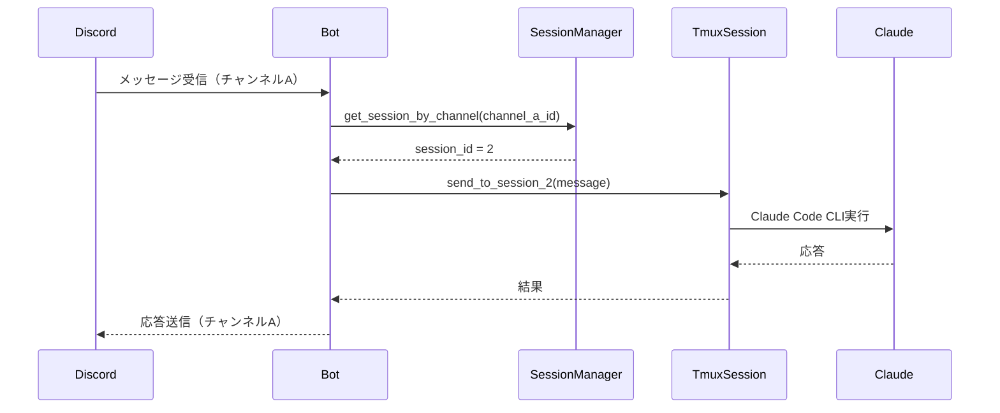
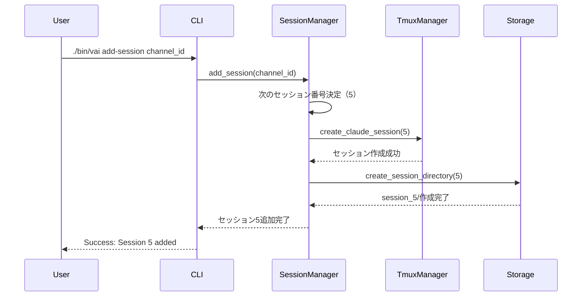
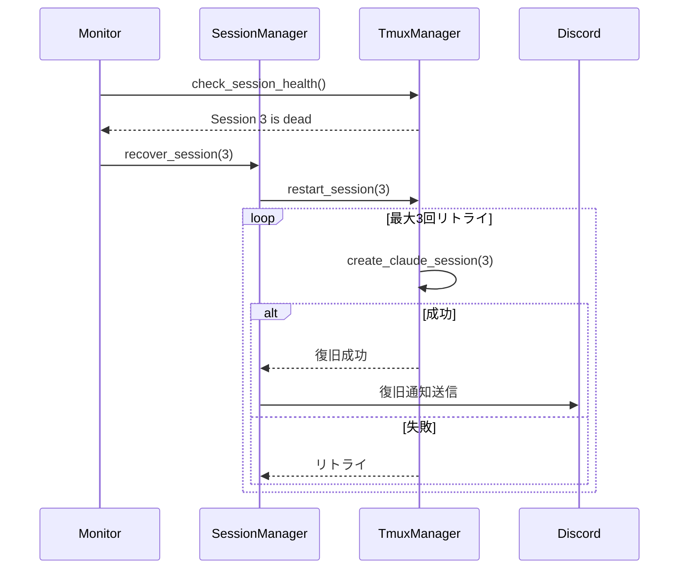

# マルチセッション機能 設計書

## 📋 概要

### 設計目的
yamkz/claude-discord-bridgeに対して、複数Discordチャンネルでの並行開発を可能にするマルチセッション機能を実装する

### 設計範囲
- セッション管理アーキテクチャ
- Attachmentsディレクトリ分離設計
- 動的セッション拡張メカニズム
- エラー復旧・監視システム

## 🏗️ アーキテクチャ設計

### システム構成図

```
┌──────────────────────────────────────────────────┐
│                Discord Server                     │
├───────────┬──────────┬──────────┬────────────────┤
│Channel #1 │Channel A │Channel B │Channel C       │
│(既存)     │(Session2)│(Session3)│(Session4)      │
└─────┬─────┴────┬─────┴────┬─────┴────┬──────────┘
      │          │          │          │
      ▼          ▼          ▼          ▼
┌─────────────────────────────────────────────────┐
│           Discord.py Bot Process                 │
│  ┌──────────────────────────────────────────┐   │
│  │        SessionManager Component          │   │
│  │  - Route messages to correct session     │   │
│  │  - Manage session lifecycle              │   │
│  └──────────────────────────────────────────┘   │
└─────┬──────────┬──────────┬──────────┬─────────┘
      │          │          │          │
      ▼          ▼          ▼          ▼
┌──────────┬──────────┬──────────┬──────────────┐
│ Session1 │ Session2 │ Session3 │ Session4     │
│  tmux    │  tmux    │  tmux    │  tmux        │
├──────────┼──────────┼──────────┼──────────────┤
│ Claude   │ Claude   │ Claude   │ Claude       │
│ Code CLI │ Code CLI │ Code CLI │ Code CLI     │
└──────────┴──────────┴──────────┴──────────────┘
      │          │          │          │
      ▼          ▼          ▼          ▼
┌──────────────────────────────────────────────┐
│            Attachments Storage               │
├──────────┬──────────┬──────────┬────────────┤
│session_1/│session_2/│session_3/│session_4/ │
└──────────┴──────────┴──────────┴────────────┘
```

### コンポーネント設計

#### 1. SessionManager（新規コンポーネント）
**責務**: セッションのライフサイクル管理とメッセージルーティング

```python
class SessionManager:
    def __init__(self, settings: SettingsManager):
        self.settings = settings
        self.sessions = {}  # {session_id: SessionInfo}
        self.channel_map = {}  # {channel_id: session_id}
        
    def initialize_sessions(self):
        """sessions.jsonからセッション情報を読み込み初期化"""
        
    def add_session(self, channel_id: str) -> int:
        """新規セッション動的追加"""
        
    def remove_session(self, session_id: int) -> bool:
        """セッション削除（将来拡張）"""
        
    def get_session_by_channel(self, channel_id: str) -> Optional[int]:
        """チャンネルIDからセッション番号を取得"""
```

#### 2. AttachmentManager改修
**変更点**: セッション別ディレクトリ管理機能追加

```python
class StorageManager:
    def __init__(self, config_dir: Path, session_id: Optional[int] = None):
        self.config_dir = config_dir
        self.session_id = session_id
        self.attachments_dir = self._get_session_dir()
        
    def _get_session_dir(self) -> Path:
        """セッション別ディレクトリパスを返す"""
        base_dir = self.config_dir / 'attachments'
        if self.session_id:
            return base_dir / f'session_{self.session_id}'
        return base_dir / 'session_1'  # デフォルト
        
    def ensure_storage_directory(self):
        """セッション別ディレクトリの作成・権限設定"""
        self.attachments_dir.mkdir(parents=True, exist_ok=True)
        # セッション間でのアクセス権分離（700権限）
        os.chmod(self.attachments_dir, 0o700)
```

#### 3. TmuxManager改修
**変更点**: 複数Claudeセッション管理機能強化

```python
class TmuxManager:
    def create_claude_session(self, session_num: int) -> bool:
        """セッション番号を指定してClaude Code CLIセッション作成"""
        session_name = f"claude-session-{session_num}"
        work_dir = self.settings.get_claude_work_dir()
        options = self.settings.get_claude_options()
        
        # tmuxセッション作成
        cmd = f"tmux new-session -d -s {session_name} -c {work_dir}"
        
    def monitor_sessions(self) -> Dict[int, SessionStatus]:
        """全セッションの死活監視"""
        
    def recover_session(self, session_num: int, retry_count: int = 3):
        """セッション自動復旧メカニズム"""
```

#### 4. DiscordBot改修
**変更点**: マルチセッション対応メッセージハンドリング

```python
class DiscordBot:
    async def on_message(self, message):
        # チャンネルIDからセッション番号を特定
        session_id = self.session_manager.get_session_by_channel(
            str(message.channel.id)
        )
        
        if not session_id:
            # デフォルトセッション（1）を使用
            session_id = 1
            
        # セッション別の処理
        await self.process_with_session(message, session_id)
```

## 📊 データ設計

### sessions.json構造
```json
{
  "1": "1405815779198369903",  // 既存チャンネル
  "2": "channel_a_id",          // チャンネルA
  "3": "channel_b_id",          // チャンネルB
  "4": "channel_c_id",          // チャンネルC
  "5": "future_channel_id"      // 動的追加例
}
```

### ディレクトリ構造
```
claude-discord-bridge-server/
├── attachments/
│   ├── session_1/           # 既存セッション用
│   │   └── IMG_*.png
│   ├── session_2/           # チャンネルA用
│   │   └── IMG_*.png
│   ├── session_3/           # チャンネルB用
│   │   └── IMG_*.png
│   ├── session_4/           # チャンネルC用
│   │   └── IMG_*.png
│   └── session_N/           # 動的作成
├── logs/
│   ├── session_1.log        # セッション別ログ
│   ├── session_2.log
│   ├── session_3.log
│   └── session_4.log
└── monitoring/
    └── metrics.json         # リソース監視データ
```

## 🔄 処理フロー設計

### 1. メッセージ受信フロー


### 2. セッション追加フロー


### 3. エラー復旧フロー


## 🔌 インターフェース設計

### CLI コマンドインターフェース
```bash
# セッション管理コマンド
./bin/vai add-session <channel_id>     # セッション追加
./bin/vai remove-session <session_num>  # セッション削除
./bin/vai list-sessions                # セッション一覧
./bin/vai recover <session_num>        # 手動復旧

# メッセージ送信拡張
dp "メッセージ"                        # デフォルトセッション
dp 2 "メッセージ"                      # セッション2指定
dp N "メッセージ"                      # セッションN指定
```

### Python API インターフェース
```python
# SessionManager API
session_manager.add_session(channel_id: str) -> int
session_manager.remove_session(session_id: int) -> bool
session_manager.get_session_by_channel(channel_id: str) -> Optional[int]
session_manager.list_sessions() -> List[SessionInfo]
session_manager.recover_session(session_id: int) -> bool

# AttachmentManager API (セッション対応)
attachment_manager = AttachmentManager(session_id=2)
attachment_manager.process_attachments(attachments) -> List[str]
attachment_manager.cleanup_old_files(max_age_days=1) -> int
```

## 🛡️ セキュリティ設計

### 1. セッション間分離
- **ファイルシステム**: 各session_N/ディレクトリは700権限
- **プロセス分離**: tmuxセッション間でのメモリ分離
- **ログ分離**: session_N.logでの個別ログ管理

### 2. チャンネルID保護
```python
class SecureSettingsManager(SettingsManager):
    def _encrypt_channel_id(self, channel_id: str) -> str:
        """AES-256暗号化実装"""
        # 環境変数から暗号化キーを取得
        key = os.environ.get('ENCRYPTION_KEY')
        # Fernet暗号化を使用
        
    def _decrypt_channel_id(self, encrypted: str) -> str:
        """復号化実装"""
```

### 3. アクセス制御
```python
def validate_session_access(user_id: str, session_id: int) -> bool:
    """ユーザーのセッションアクセス権限検証"""
    # Discord権限チェック
    # セッション所有者チェック
```

## 🎯 パフォーマンス設計

### リソース制限実装
```python
class ResourceMonitor:
    MAX_MEMORY_PER_SESSION = 512 * 1024 * 1024  # 512MB
    MAX_TOTAL_MEMORY = 2 * 1024 * 1024 * 1024   # 2GB
    MAX_ATTACHMENTS_PER_SESSION = 250 * 1024 * 1024  # 250MB
    
    def check_limits(self, session_id: int) -> ResourceStatus:
        """リソース使用量チェック"""
        
    def enforce_limits(self, session_id: int):
        """制限超過時の処理"""
        # メモリ制限: cgroups使用
        # ディスク制限: quota設定
```

### 並行処理制御
```python
class ConcurrencyController:
    def __init__(self):
        self.file_semaphore = asyncio.Semaphore(5)  # セッション当たり5ファイル
        self.global_semaphore = asyncio.Semaphore(20)  # 全体20ファイル
        
    async def process_with_limit(self, coro):
        """並行処理制限付き実行"""
        async with self.global_semaphore:
            async with self.file_semaphore:
                return await coro
```

## 📈 監視・ログ設計

### メトリクス収集
```python
class MetricsCollector:
    def collect_metrics(self) -> Dict:
        return {
            "timestamp": datetime.now().isoformat(),
            "sessions": {
                f"session_{i}": {
                    "status": self.get_session_status(i),
                    "memory_usage": self.get_memory_usage(i),
                    "disk_usage": self.get_disk_usage(i),
                    "response_time": self.get_avg_response_time(i)
                }
                for i in self.active_sessions
            },
            "system": {
                "total_memory": self.get_total_memory(),
                "cpu_usage": self.get_cpu_usage()
            }
        }
```

### アラート実装
```python
class AlertManager:
    THRESHOLDS = {
        "memory_percent": 80,
        "disk_percent": 90,
        "response_time_ms": 3000
    }
    
    async def check_and_alert(self, metrics: Dict):
        """閾値チェックとDiscordアラート送信"""
        for session_id, data in metrics["sessions"].items():
            if data["memory_usage"] > self.THRESHOLDS["memory_percent"]:
                await self.send_discord_alert(
                    f"⚠️ Session {session_id}: Memory usage {data['memory_usage']}%"
                )
```

## 🔧 エラーハンドリング設計

### エラー分類と対処
```python
ERROR_HANDLERS = {
    TmuxSessionError: {
        "recovery": "restart_session",
        "max_retry": 3,
        "backoff": "exponential"
    },
    AttachmentConflictError: {
        "recovery": "rename_with_suffix",
        "notification": True
    },
    ResourceLimitError: {
        "recovery": "throttle_and_queue",
        "alert": True
    },
    ChannelNotFoundError: {
        "recovery": "use_default_session",
        "log_level": "warning"
    }
}
```

### 自動復旧メカニズム
```python
class AutoRecoveryManager:
    async def recover_with_backoff(self, session_id: int, error: Exception):
        """指数バックオフ付き自動復旧"""
        for attempt in range(3):
            wait_time = 2 ** attempt  # 1, 2, 4秒
            await asyncio.sleep(wait_time)
            
            try:
                await self.recover_session(session_id)
                await self.notify_recovery_success(session_id)
                return True
            except Exception as e:
                logger.error(f"Recovery attempt {attempt+1} failed: {e}")
                
        await self.notify_recovery_failure(session_id)
        return False
```

## 🚀 拡張性考慮事項

### 将来の拡張ポイント
1. **セッション上限撤廃**: 動的リソース管理システムへの移行
2. **Kubernetes対応**: コンテナ化とオーケストレーション
3. **分散アーキテクチャ**: 複数ホストでのセッション分散
4. **Web UI管理画面**: セッション管理のWeb化
5. **API Gateway**: RESTful API経由でのセッション制御

### マイグレーション考慮
```python
class MigrationManager:
    def migrate_existing_attachments(self):
        """既存attachments/直下のファイルをsession_1/へ移行"""
        old_files = Path("attachments").glob("IMG_*")
        session_1_dir = Path("attachments/session_1")
        session_1_dir.mkdir(exist_ok=True)
        
        for file in old_files:
            shutil.move(str(file), str(session_1_dir / file.name))
            logger.info(f"Migrated {file.name} to session_1/")
```

## 📋 設計判断記録

### DR-001: セッション番号採用
**決定**: チャンネル名ではなくセッション番号（1, 2, 3...）を採用
**理由**: 
- 番号による順序性と拡張性
- ディレクトリ名の簡潔性
- tmuxセッション名との整合性

### DR-002: Attachments分離方式
**決定**: session_N/ディレクトリによる物理分離
**理由**:
- ファイルシステムレベルでの確実な分離
- 権限管理の簡潔性
- バックアップ・リストアの容易性

### DR-003: 暗号化の選択的実装
**決定**: チャンネルID暗号化は初期実装では簡易実装
**理由**:
- 開発環境での利便性優先
- 本番環境でのみ完全暗号化
- 段階的セキュリティ強化方針

---

## 📅 作成日時
2025-08-27

## 📊 ステータス
設計書作成完了 - 100回仮想会議レビュー待ち