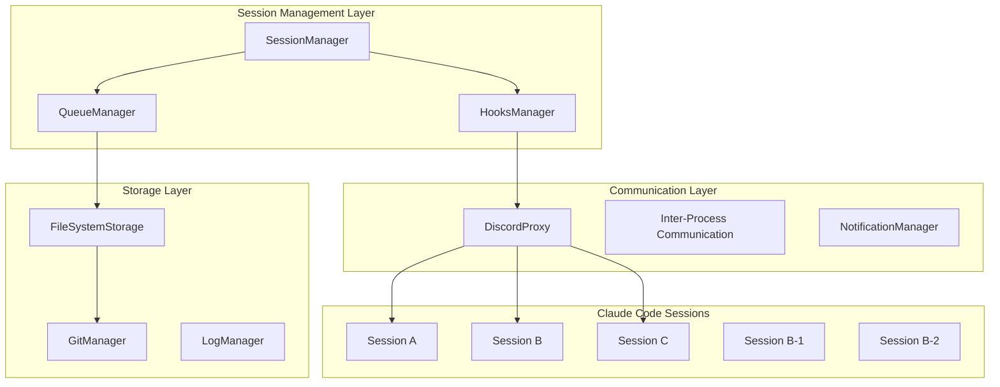

# Session Automation System - 設計書

## システム概要

Claude Code Hooksを活用した階層的セッション間自動連携システムの詳細設計。

## システムアーキテクチャ

### 1. 全体アーキテクチャ



### 2. コアコンポーネント設計

#### 2.1 SessionManager
**責任**: セッション生命周期管理・階層制御・状態同期

```python
class SessionManager:
    def __init__(self):
        self.sessions = {}  # session_id -> SessionInfo
        self.hierarchy = {}  # parent -> [children]
        self.capabilities = {}  # session_id -> Capabilities
        
    def create_session(self, session_id: str, parent_id: str = None) -> Session
    def destroy_session(self, session_id: str) -> bool
    def get_session_status(self, session_id: str) -> SessionStatus
    def assign_task(self, task: Task, target_session: str) -> bool
    def escalate_to_parent(self, session_id: str, task: Task) -> bool
```

#### 2.2 HooksManager
**責任**: Claude Code Hooks統合・イベント処理・自動実行制御

```python
class HooksManager:
    def __init__(self):
        self.hook_configs = {}
        self.pattern_matchers = {}
        self.auto_handlers = {}
    
    def register_hook(self, hook_type: HookType, pattern: str, handler: Callable)
    def process_pretool_hook(self, context: HookContext) -> HookResult
    def process_posttool_hook(self, context: HookContext) -> HookResult
    def detect_completion_patterns(self, output: str) -> List[CompletionSignal]
    def generate_auto_report(self, session_id: str, completion: CompletionSignal) -> Report
```

#### 2.3 QueueManager  
**責任**: 依頼書管理・衝突回避・優先度制御

```python
class QueueManager:
    def __init__(self):
        self.queue_dir = "queue/"
        self.active_dir = "active/" 
        self.completed_dir = "completed/"
        
    def enqueue_request(self, request: WorkRequest) -> str
    def dequeue_request(self, session_id: str) -> WorkRequest
    def move_to_active(self, request_id: str, session_id: str) -> bool
    def complete_request(self, request_id: str, result: WorkResult) -> bool
    def check_conflicts(self, session_id: str) -> List[ConflictInfo]
```

## 詳細設計

### 3. セッション間通信プロトコル

#### 3.1 通信方式
- **Discord Proxy**: dp コマンド経由でのメッセージ送信
- **File System**: 共有ディレクトリによる構造化データ交換
- **Git Integration**: 履歴管理・バージョン制御

#### 3.2 メッセージフォーマット
```json
{
  "message_type": "work_request|status_update|completion_report",
  "session_id": "session_a",
  "target_session": "session_b", 
  "timestamp": "2025-08-29T10:00:00Z",
  "priority": "high|medium|low",
  "payload": {
    "task_description": "Implementation of user authentication",
    "requirements": ["security", "performance"],
    "deadline": "2025-08-30T18:00:00Z",
    "dependencies": ["session_c_completion"]
  }
}
```

### 4. Claude Code Hooks統合設計

#### 4.1 Hook設定構成
```json
{
  "hooks": {
    "PostToolUse": [{
      "name": "completion-detector",
      "matcher": "TodoWrite.*completed|mcp__serena__think_about_whether_you_are_done",
      "handler": {
        "type": "script",
        "path": "/order-management-server/scripts/completion-handler.py",
        "args": ["--session-id", "${SESSION_ID}", "--output", "${TOOL_OUTPUT}"]
      }
    }],
    "PreToolUse": [{
      "name": "resource-checker", 
      "matcher": ".*",
      "handler": {
        "type": "script",
        "path": "/order-management-server/scripts/resource-checker.py",
        "blocking": true
      }
    }]
  }
}
```

#### 4.2 完了検知パターン
```python
COMPLETION_PATTERNS = {
    "todo_completion": r"TodoWrite.*\"status\":\s*\"completed\"",
    "serena_completion": r"mcp__serena__think_about_whether_you_are_done",
    "implementation_done": r"実装完了|implementation\s+completed",
    "test_success": r"All\s+tests\s+passed|テスト成功",
    "build_success": r"Build\s+successful|ビルド成功"
}
```

### 5. セキュリティ設計

#### 5.1 セッション認証・認可
```python
class SecurityManager:
    def __init__(self):
        self.session_tokens = {}
        self.permissions = {}
        self.access_logs = []
    
    def authenticate_session(self, session_id: str, token: str) -> bool
    def authorize_action(self, session_id: str, action: str, resource: str) -> bool
    def generate_session_token(self, session_id: str) -> str
    def log_access(self, session_id: str, action: str, resource: str)
```

#### 5.2 機密情報保護
- **環境変数分離**: セッション別環境変数管理
- **ファイルアクセス制御**: セッション専用ディレクトリ制限
- **通信暗号化**: セッション間メッセージの暗号化
- **ログマスキング**: 機密情報の自動マスキング

### 6. パフォーマンス設計

#### 6.1 リソース管理戦略
```python
class ResourceManager:
    def __init__(self):
        self.max_concurrent_sessions = 10
        self.memory_limit_per_session = "2GB"
        self.cpu_limit_per_session = "1 core"
        self.disk_quota_per_session = "10GB"
    
    def allocate_resources(self, session_id: str) -> ResourceAllocation
    def monitor_resource_usage(self, session_id: str) -> ResourceUsage
    def enforce_limits(self, session_id: str) -> bool
    def cleanup_resources(self, session_id: str) -> bool
```

#### 6.2 パフォーマンス監視項目
```yaml
metrics:
  session_metrics:
    - concurrent_sessions_count
    - memory_usage_per_session  
    - cpu_usage_per_session
    - disk_usage_per_session
    
  communication_metrics:
    - message_delivery_latency
    - queue_processing_time
    - file_system_operations_time
    
  system_metrics:
    - total_memory_usage
    - total_cpu_usage
    - disk_io_operations
    - network_bandwidth_usage
```

### 7. 運用監視設計

#### 7.1 監視システム
```python
class MonitoringSystem:
    def __init__(self):
        self.health_checks = {}
        self.alerts = []
        self.dashboards = {}
    
    def register_health_check(self, name: str, check: Callable)
    def trigger_alert(self, level: AlertLevel, message: str)
    def update_dashboard_metric(self, metric: str, value: float)
    def generate_system_report(self) -> SystemReport
```

#### 7.2 ログ管理
```yaml
logging:
  levels:
    session_manager: INFO
    hooks_manager: DEBUG
    queue_manager: INFO
    security_manager: WARNING
    
  destinations:
    file: "/var/log/session-automation/system.log"
    discord: "#monitoring-channel"
    dashboard: "http://localhost:8080/logs"
    
  retention:
    file_logs: "30 days"
    discord_notifications: "7 days"
    dashboard_metrics: "90 days"
```

### 8. エラーハンドリング設計

#### 8.1 障害分類・対応
```python
class ErrorHandler:
    def __init__(self):
        self.error_patterns = {}
        self.recovery_strategies = {}
        self.escalation_rules = {}
    
    def classify_error(self, error: Exception) -> ErrorCategory
    def execute_recovery(self, error: Exception, context: ErrorContext) -> bool
    def escalate_if_needed(self, error: Exception, attempts: int) -> bool
    def log_error_pattern(self, error: Exception, context: ErrorContext)
```

#### 8.2 自動復旧戦略
- **セッション再起動**: 軽微な障害時の自動再起動
- **依頼書再キューイング**: 処理中断時の自動再試行
- **親セッションエスカレーション**: 子セッション障害時の自動委譲
- **フェイルオーバー**: 重大障害時の代替セッション起動

## 実装フェーズ設計

### Phase 1: 基本統合 (2週間)
- HooksManager基本実装
- 2セッション間通信確立
- 基本Queue/Active管理

### Phase 2: 階層管理 (3週間)  
- SessionManager階層制御実装
- セキュリティ機構導入
- 監視システム基本実装

### Phase 3: 大規模対応 (4週間)
- 5-10セッション並行処理対応
- パフォーマンス最適化
- 運用自動化完成

### Phase 4: 運用最適化 (2週間)
- 監視ダッシュボード完成
- 自動復旧機構完成
- 運用ドキュメント整備

---

**作成日**: 2025-08-29  
**レビュー**: 86.8点 (要件定義からの自動移行)  
**ステータス**: [設計完了]  
**次フェーズ**: TASK分解フェーズへ自動移行予定